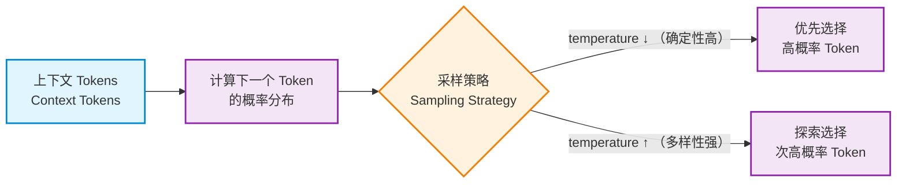

在开始写任何复杂的 LLM 应用之前，我们必须先解决一个根本问题：

> **LLM 到底在“干什么”？**

如果你对这个问题的理解是模糊的，那么后面所有工程决策——Prompt 怎么写、参数怎么调、是否要加 RAG、什么时候该用 Agent——都会变成“试出来的经验”，而不是可复用的能力。

本章我们不从“官方定义”开始，而是从**你在真实开发中一定遇到过的困惑**说起。

---

### 1.1 一个反直觉的问题：LLM 真的「理解」语言吗？

先看一个你大概率遇到过的现象：

- 同一个 Prompt
- 同一个模型
- 有时回答像专家
- 有时却一本正经地胡说八道

于是你可能会问：

> **它到底懂不懂我在说什么？**

直觉上，我们很容易把 LLM 当成一个“理解语言的智能体”。但如果你站在工程视角，这种理解反而会误导你。

一个更接近事实、也更有用的结论是：

> **LLM 并不理解语言，它在做的是「基于上下文的概率预测」。**

这句话非常重要，后面几乎所有设计原则都会从这里推导出来。


既然 LLM 的核心行为是 “基于上下文的概率预测”，那从计算逻辑的角度，我们该如何抽象这种行为？如果把它看作一个函数，这个函数的输入和输出又是什么？这正是我们接下来要拆解的核心 —— 用函数视角重新理解 LLM 的工作机制。

---

### 1.2 用函数视角重新理解 LLM

如果我们暂时抛开“智能”“理解”这些词，只从计算角度看，LLM 的核心行为可以抽象成一个函数：

```text
next_token = f(已有的所有 token)
```

也就是说：

- 输入：你给它的所有上下文（system / user / assistant）
- 输出：**下一个最可能出现的 token**

不断重复这个过程，就得到了完整的回答。

这里有三个关键点，请你特别留意：

1. **LLM 永远只预测下一个 token**，它并不知道“整段话是否正确”；
2. 所谓的“推理过程”，只是多步 token 预测的自然结果；
3. 模型对世界的全部认知，都来自你提供的上下文。

但这个 “只预测下一个 token” 的函数，似乎与我们观察到的现象有矛盾：当我们让 LLM 解数学题或写代码时，它明明能展现出 “一步步推导” 的能力。这难道不算是 “推理” 吗？

---

### 1.3 为什么它「看起来」会推理？

你可能会反驳：

> 可是 LLM 明明能一步步推导数学题、写出复杂代码？

这并不矛盾。

原因在于：

- 在训练阶段，模型看过**大量“推理过程长什么样”**的文本
- 它学会了：
  - 在什么上下文下
  - 下一步“看起来合理”的 token 是什么

当你要求它“逐步思考”“一步一步推导”时，

> 它并不是在“思考”，而是在**模仿一种常见的文本模式**。

这也是为什么 **Chain-of-Thought 是一种提示策略，而不是模型能力本身**。


---

### 1.4 采样机制：随机性从哪里来？

既然 LLM 是在“预测下一个 token”，那为什么同一个 Prompt 会有不同结果？

这种随机性并非偶然，而是模型生成过程中一个关键机制的直接体现，答案在于：采样机制

> **模型输出的不是一个确定值，而是一个概率分布。**

简化后的过程如下：




- temperature 越低：越偏向“最可能”的结果
- temperature 越高：越容易探索“次优但合理”的结果

**随机性不是噪声，而是模型能力的一部分。**

工程问题在于：

> 你是否在合适的场景下，使用了合适的随机性？

---

### 1.5 第一性原理小结（非常重要）

从 “不理解语言，只做概率预测”，到 “函数视角下的 token 生成”，再到 “推理是模仿文本模式” 和 “随机性来自采样机制”，我们已经拆解了 LLM 的核心行为逻辑。现在，我们可以基于这些观察，提炼出一组工程视角下的第一性原理 —— 这将成为后续所有系统设计的底层逻辑。

这一组**工程级结论**即：

- LLM 不是知识库
- LLM 不是规则引擎
- LLM 也不是“思考主体”

而是：

> **一个基于上下文进行概率生成的语言函数**

这意味着：

- 它的所有能力，都依赖于输入
- 它的所有不可靠性，也来自输入

**你能控制的，不是模型本身，而是系统如何使用它。**


既然 “系统如何使用 LLM” 是可控的核心，那么在系统设计中，除了输入的上下文（比如 Prompt），还有哪些因素会直接影响 LLM 的行为？

如果你曾困惑于 “为什么同样的模型和 Prompt，效果时好时坏”，答案很可能藏在那些被你当作 “微调参数” 的配置里 —— 它们其实是控制 LLM 行为的核心面板。接下来的第二章，我们就来拆解这些参数的真正作用。