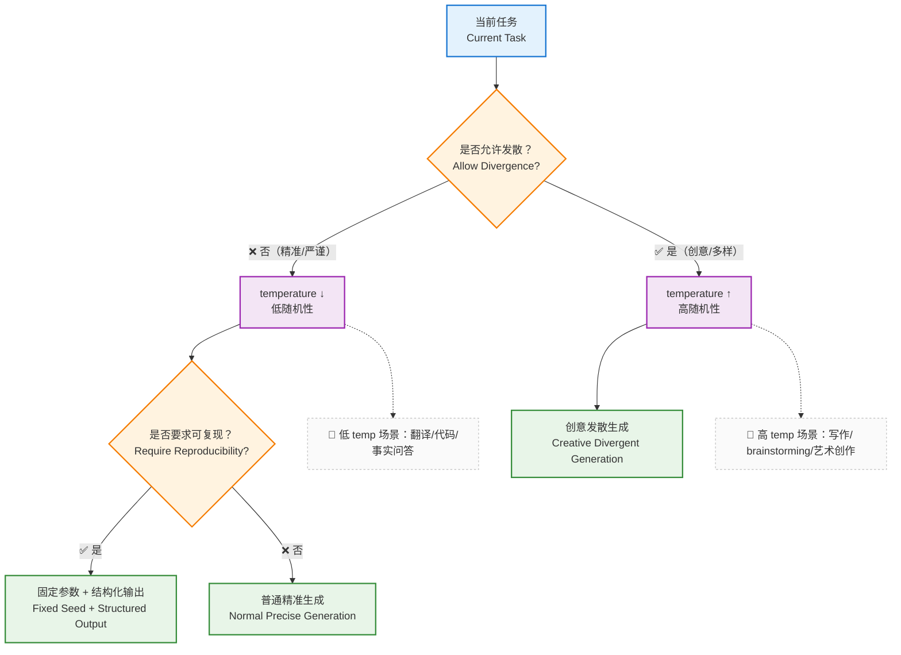
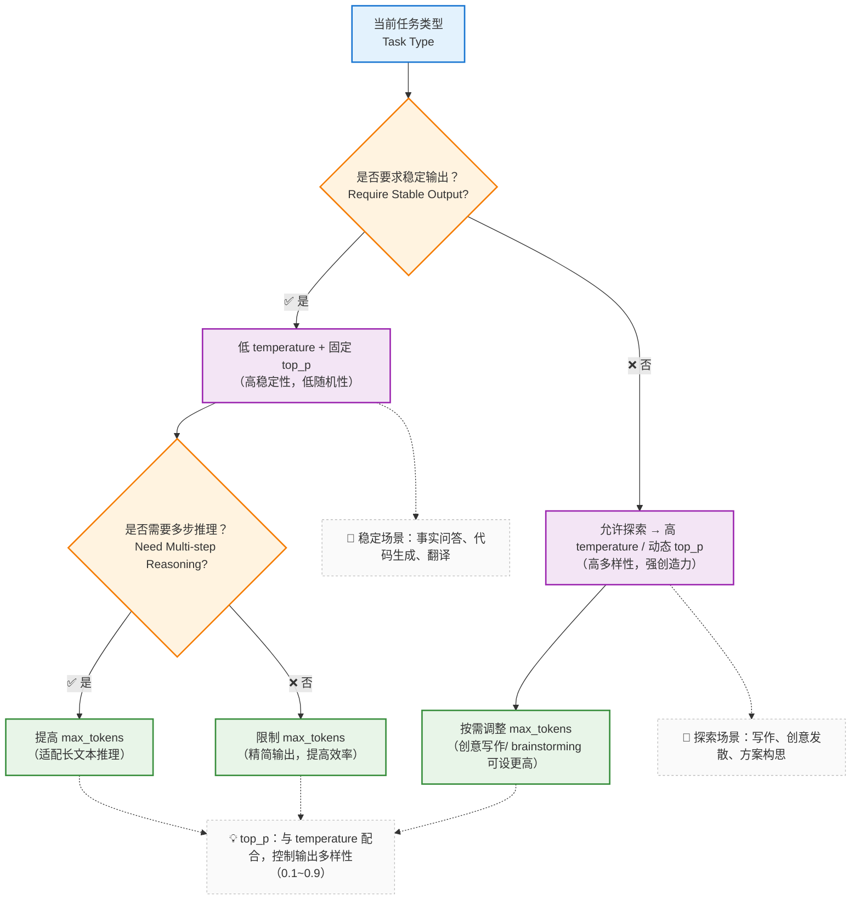

在了解 LLM 的基本工作方式之后，我们来看一个**实际体验中很常见的问题**：

> **为什么同一个模型、同样的 Prompt， 有时表现很好，有时却很糟糕？**

---

### 2.1 一个常见困惑：为什么效果忽好忽坏？

在实际使用中，我们可能都遇到过，选择了更牛的模型、也按照要求反复调整了提示词，在demo中表现挺好，可是只要一上线，各种问题就来了，如

* 输出不稳定
* 有时啰嗦，有时过于简短
* 出现不符合现状或者自相矛盾的结果

然后我们能干啥呢？ 换个模型？ 调整下提示词？ 或者随机改一下传参？ 即便是某一次碰巧搞定了，也不知道为啥。 将确定的编程过程整成了玄学，一个雷放在那儿、随时可能爆炸，这可以说是一个码农的噩梦了。


但问题到底出在什么地方呢？LLM开发让人头疼的一点也在于此，不像我们的业务代码，还可以通过debug，单步到核心逻辑去研究一下；大模型对于开发者而言，更多的是一个黑盒，想调试也束手无策

一般这种场景下，问题有可能并不在模型本身，而在于：

> **你是否意识到：参数本身就是“行为策略”？**


当我们说 “参数是行为策略”，并不是指那些随意调整的 “玄学数值”。 比如 `temperature` 和 `top_p` 这两个最常用的参数，很多地方将他们描述为 “控制创造性的调味料”，这种描述挺贴切的，但是在具体的编码活动中，我们可能更希望有一个确切的数值标准，如果有不同的应用场景的最佳参数设置实践，那就更完美了。

接下来，我们仔细盘一下这两个参数 —— 它们到底在控制 LLM 的什么行为？

---

### 2.2 temperature / top_p 不是“调味料”

网上很多教程中，将`temperature` 解释为 **“控制创造性，越大越发散”** 的核心控制参数

这句话**挺贴切的，从工程化的角度改怎么理解呢？**。

使用更专业或者不那么容易懂语言进行解释

> **temperature 决定：模型是否允许偏离当前最优预测路径。**

* temperature 越低
  → 越倾向选择概率最高的 token
* temperature 越高
  → 越允许探索次优甚至低概率路径的 token

从上面的描述，也可以得出一个直观的感受，temperature的取值，可影响

* 输出是否可复现
* 行为是否稳定
* 是否适合被系统消费（而不仅是人阅读）

---

#### 那 top_p 又是什么？

如果说 temperature 是“整体发散程度”，那 `top_p` 更像是：

> **你允许模型在“多大的候选范围”里做选择。**

* `top_p = 0.9`
  → 只从累计概率前 90% 的 token 中选
* `top_p = 1.0`
  → 几乎不做限制

请注意，所有的参数都不是独立生效的，他们必然是相互影响的（感觉像是废话，参数都是一起传给大模型的，肯定是一起工作的啊🤣）

在实际的开发过程中，不妨借鉴一下 “控制变量法” 的思路来进行调参：

* **固定其中一个**
* **调另一个作为主策略**

显然这又是一个痛苦和煎熬的反复拉扯过程~

---

### 2.3 model：不是“越强越好”，而是“是否匹配任务”

有一个反直觉的事实表现：

> **模型越大、越新，系统并不一定表现就越好。**

在真实的应用抉择上，模型选择其实是一个多方面的**工程权衡问题**：

* 能力上限
* 成本
* 延迟
* 行为一致性

比如几个经典的应用场景下对模型的要求：

* **规则解释 / 企业知识问答**

  * 更需要稳定、克制
  * 不一定需要最“聪明”的模型

* **创意生成 / 头脑风暴**

  * 可以接受不确定性
  * 模型探索能力更重要

因此，一个更健康的视角是：

> **model 是能力边界，参数决定你是否触碰这个边界。**

---

### 2.4 max_tokens：你允许系统“说到什么程度”

`max_tokens` 经常被当作一个简单的“长度限制”。

但在系统层面，它真正控制的是：

> **模型是否被允许“继续展开思路”。**

这在以下场景尤为关键：

* 多步推理
* 解释性回答
* Agent 场景中的中间推理

如果 `max_tokens` 过低，导致 `推理会被强行截断` + `输出容易“看似合理但不完整”`

如果过高，也会导致 `成本上升` + `模型更容易开始“自由发挥”`

所以它本质上是：

> **对“思考深度”的一种工程约束。**


看到这里不知道你脑海里是否和我有相同的感觉，这种大模型调用的传参，感觉变成了一个`经验学科`了，只有实际体验得多了，才知道什么场景、选择什么样的传参🤣

---

### 2.5 stream：不是体验优化，而是系统架构选择

`stream` 可以简单的理解为 `能不能一边生成一边显示结果`

在复杂系统中，它还包含着一些潜在的含义：

* 是否允许**增量消费输出**
* 是否能在生成过程中：
  * 中断
  * 校验
  * 触发后续逻辑

在 Agent / Tool / 长文本场景中：

* 非流式 → 一次性黑箱结果
* 流式 → 可观测、可干预

从上面的描述也可以看出，流式调用除了体验的优化之外，还有一些系统约束层面的能力

> **LLM可以是“一次性函数调用”之外，作为系统的一部分存在**


### 2.6 用「任务类型」来决定参数，而不是凭感觉

上面说了这些参数，那么在我的应用场景中，具体应该怎么设置呢， 全部用默认参数吗？

显然一个更合理的做法是：

> **先判断你在做什么任务，再决定参数策略。**


比如根据实际场景，我是否需要一个发散性的回复，例如

- 代码生成：
  - temperature 低
  - 输出结构稳定
- 创意写作：
  - temperature 高
  - 接受一定不确定性





一组参数配合调参，应对不同的应用场景：




---

### 2.7 把参数当成策略的一部分（伪代码示例）

明确了 “任务类型决定参数策略” 的逻辑后，接下来我们再来看一下，代码实现上，可以怎么进行表现（好像也是简单的if/else 😊）

```python
def build_llm_config(task_type):
    if task_type == "fact_query":
        return {
            "model": "stable-model",
            "temperature": 0.1,
            "top_p": 0.9,
            "max_tokens": 500,
            "stream": False
        }

    if task_type == "code_generation":
        return {
            "model": "code-model",
            "temperature": 0.2,
            "top_p": 0.95,
            "max_tokens": 1500,
            "stream": False
        }

    if task_type == "agent_reasoning":
        return {
            "model": "reasoning-model",
            "temperature": 0.3,
            "top_p": 0.9,
            "max_tokens": 3000,
            "stream": True
        }

    if task_type == "creative":
        return {
            "model": "creative-model",
            "temperature": 0.9,
            "top_p": 1.0,
            "max_tokens": 800,
            "stream": True
        }
```

---

### 2.8 本章小结

这一篇的内容主要介绍了大模型访问的几个关键传参，并且声明了大模型表现与参数配置之间的关系

* 模型决定能力上限
* 参数决定行为方式
* 行为决定系统是否可靠

在后面的章节中我们也会逐渐发现

* Prompt 是**约束**
* 参数是**策略**
* RAG / Tool / Memory 是**补偿机制**

所有的这一切，都是围绕着 **如何让一个不可靠的模型，在系统中变得可控。** 努力

既然参数这一块已经说明，接下来自然就是重头戏，如何与LLM进行对话交流，所以下一部分，我们将正式进入 `Prompt` 工程，但不从“怎么写”开始，而是先回答：

**Prompt 为什么会失败？**
