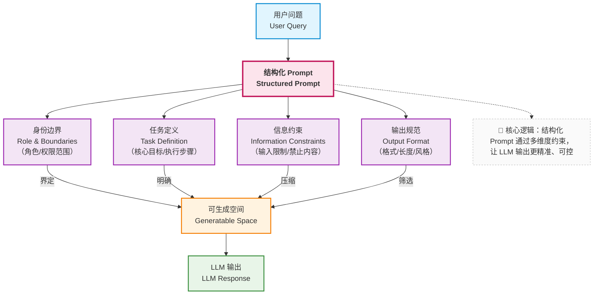

既然 Prompt 的本质是“约束生成空间”，那么它就不应该是随意拼接的字符串，而应该具备清晰、稳定、可复用的结构。

---

### 4.1 Prompt 为什么必须结构化？

请思考一个问题：

> 如果 Prompt 改了一句话，系统行为发生了明显变化， 这是好事，还是坏事？

在工程视角下，这通常是一个**危险信号**。

因为它意味着：

- 行为不可预测（改一个词就 “性情大变”，说明系统没有稳定的约束逻辑）
- 改动影响范围不可控（不知道改这句话会让哪些场景的输出出错）

结构化 Prompt 的目标正是：

> **让系统行为的变化，来源于“有意识的设计”，
> 而不是偶然的文本差异。**

例如，当你想调整 “是否允许模型使用外部知识” 时，只需要修改 “约束/Constraints” 部分的某一条规则，而不是在整个 Prompt 中 “凭感觉加一句话”—— 这样的改动可预期、可追溯。

---

### 4.2 一个可解释、可扩展的 Prompt 结构

在企业知识库助手中，我们采用如下四段式结构：

```text
1. Role：身份与责任边界
2. Task：当前要完成的具体目标
3. Constraints：显式禁止的行为
4. Output Schema：可评估的输出形式
```

这四部分分别解决四个不同的问题：

- 我是谁？（Role：明确模型的 “权限范围” 和 “责任边界”，避免越权行为）
- 我要做什么？（Task：锁定当前任务的核心目标，避免答非所问）
- 我不能做什么？（Constraints：划出 “红线”，禁止可能导致错误的行为）
- 我的结果如何被判断？（Output Schema：定义输出的格式和标准，让 “对 / 错” 可量化）

这个结构的优势在于：

- 可解释性：任何一个环节的设计都有明确目的，便于团队协作理解
- 可扩展性：需要新增约束时，直接在对应部分补充即可，无需重构整体
- 可测试性：每一部分都能单独验证（比如测试 Constraints 是否有效阻止了幻觉）

---

### 4.3 将结构落地到企业知识库助手（深入示例）

```text
【Role】
你是公司内部的企业知识库助手，
你的职责是基于公司提供的正式资料（以下简称“参考资料”）回答员工的问题。
你没有权限访问公司未公开的信息，也不具备超出资料范围的决策能力。

【Task】
根据下方“参考资料”中的内容，准确回答用户提出的问题。
若问题涉及多个资料片段，需整合后输出；若资料中存在冲突，需全部列出并标注来源。

【Constraints】
- 只能使用参考资料中的信息，禁止引入任何外部知识（包括通用常识、其他公司的制度等）
- 禁止进行“合理推断”：资料未明确说明的内容，即使“看起来显然”，也不得作为结论输出
- 若资料完全不涉及用户问题，或信息不完整导致无法回答，必须明确回答“不知道”，不得编造内容
- 禁止简化或修改资料中的关键信息（如数字、时间、审批节点等）

【Output Schema】
- 回答需简洁、正式，使用中文
- 优先用短句，避免长句和复杂修饰
- 所有结论必须标注对应的参考资料编号（格式：【资料X】），若涉及多个资料，需分别标注
- 若资料存在冲突，输出格式为：“关于XX问题，资料存在不同描述：1. 【资料A】...；2. 【资料B】...”
```

注意这里的几个关键设计细节：

- **Role 部分的权责绑定**：不仅说了 “是什么”，还明确了 “不是什么”（没有权限访问未公开信息），从源头限制模型的 “越界冲动”。
- **Task 部分的冲突处理**：提前定义 “资料冲突时需全部列出”，避免模型 “主观选择” 一个更 “合理” 的答案（而忽略真实的资料矛盾）。
- **Constraints 中的 “禁止推断”**：在企业场景中，“资料没说 = 不能确定”，比如资料只写了 “销售部可享受 XX 福利”，模型不能推断 “其他部门不可享受”（可能只是资料漏写）。
- **Output Schema 的可验证性**：通过 “标注资料编号”，用户可以直接回溯原始资料验证答案；冲突处理的格式要求，让 “矛盾信息” 一目了然，避免误导。

其中最核心的设计是：

> **“不知道”被明确列为一种合法输出。**

这一步对于企业系统至关重要，因为它第一次从 Prompt 层面：

> **压缩了幻觉出现的空间。**

模型会意识到：“说不知道” 是被允许的，甚至是更安全的选择，而不是必须 “强行给一个答案”。

---

### 4.4 Prompt 结构如何影响生成空间（示意图）




这个示意图的核心逻辑是：

- Role 和 Task 先框定 “大致范围”（比如 “企业知识库助手”+“回答资料相关问题”）
- Constraints 像 “过滤器” 一样压缩空间（去掉 “外部知识”“推断内容” 等无效区域）
- Output Schema 最后筛选出 “符合格式标准” 的输出（确保结果可评估）

最终的 “可生成空间” 越小、越明确，LLM 输出的可靠性就越高。


结构化 Prompt 解决了 “单次调用” 的约束问题，但在真实的企业系统中，Prompt 不会是 “一劳永逸” 的 —— 新业务场景会要求新增约束，多部门复用会需要灵活适配，版本迭代会需要追溯变更。这意味着 Prompt 不能只停留在 “设计” 层面，还需要进入工程化的治理体系，像代码一样被管理、被复用、被迭代 —— 这正是第 5 章要聚焦的 “从 Prompt 到 Prompt 模板与工程治理”。