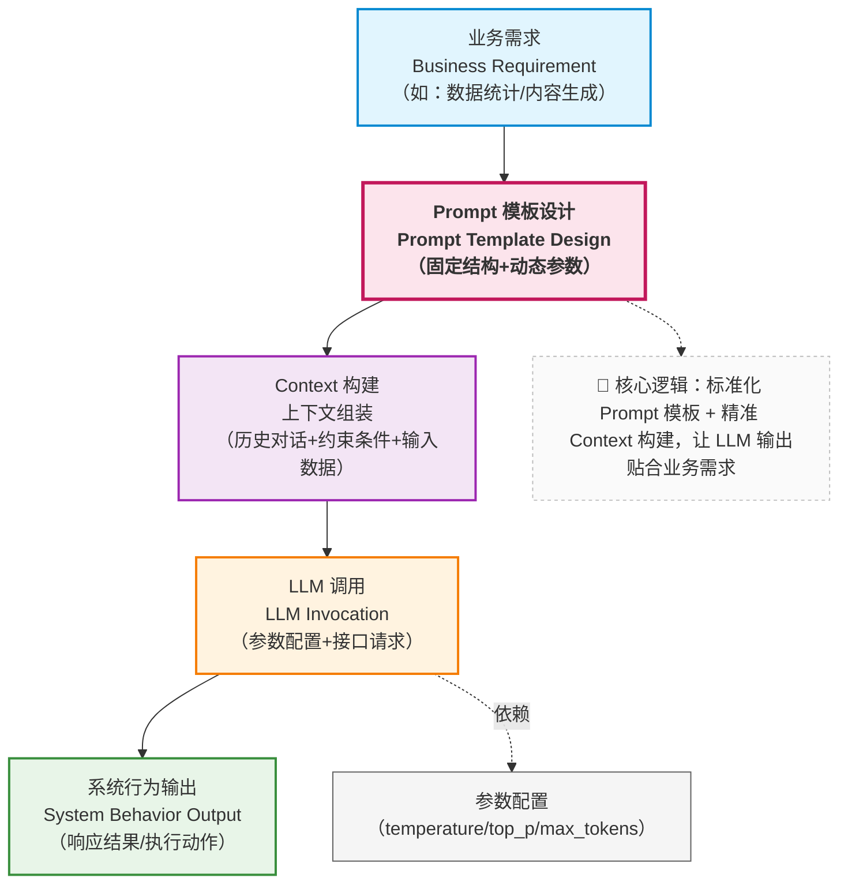
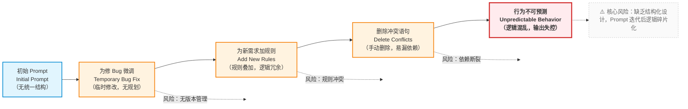

当你的系统开始被真实用户使用时，你会很快发现：

- Prompt 不是一次性工作（初期设计总会有遗漏，比如没考虑 “资料重复” 的处理）
- Prompt 会不断演进（新的业务场景出现，需要新增约束；模型升级后，可能需要调整规则）
- 而且每一次修改，都可能悄悄改变系统行为

这意味着：

> **Prompt 必须进入工程治理体系。**

---

### 5.1 Prompt 是“软代码”，而不是文案


在很多早期项目中，Prompt 往往以这样的形式存在：

* 写在代码里的一段字符串
* 存在 Notion / 文档中的一段描述
* 甚至只存在于某个同事的“经验里”

这在 Demo 阶段或许还能接受，但在企业知识库助手这样的系统中，这是**极其危险的**。

如在企业知识库助手中：

- Prompt 的一次微调（比如删掉 “禁止推断”）
- 可能直接影响业务决策（员工根据错误推断的内容执行操作）

这种不可控性，很容易产生不可预知的后果，而产生这些问题的原因也很简单：

* Prompt 决定模型的**行为边界**
* Prompt 的一次微调，可能直接影响：

  * 回答是否合规
  * 是否产生幻觉
  * 是否越权推断

从工程视角看，你必须接受一个事实：

> **Prompt 是一种“软代码（Soft Code）”。**

它和代码的区别只在于：

* 不是由编译器执行
* 而是由模型“解释执行”


因此你需要像对待代码一样对待 Prompt：

- 版本管理：记录每一次修改的时间、修改人、修改原因（例如 “v1.2 新增‘资料冲突处理规则’，解决财务制度矛盾问题”）
- 可回滚：当某次修改导致错误率上升时，能快速切回上一个稳定版本
- 可审计：在出现问题时，能追溯到某版 Prompt 的设计逻辑，分析漏洞来源

---

### 5.2 什么是 Prompt 模板？（不是字符串复用）

很多人第一次听到“Prompt 模板”时，会误以为：

> *不就是把 Prompt 抽成一个格式化字符串吗？*

这只是最表层的理解。

更准确地说：

> **Prompt 模板是一种“设计决策的结构化表达”。**

它的核心目标不是复用文本，而是**固定认知结构**。


#### 一个最小但正确的 Prompt 模板结构

```python
PROMPT_TEMPLATE = """
【Role】
{role}

【Task】
{task}

【Constraints】
{constraints}

【Output Schema】
{output_schema}


【参考资料】
{reference_materials}
"""
```


请注意：
这里的每一块，并不是为了“好看”，而是为了**工程可控性**。

在工程实践中，这意味着：

- Prompt 可以被 review：团队成员能清晰看到 “Role/Task/Constraints” 等模块的设计，针对性提出意见（比如 “Constraints 漏了‘禁止修改数字’”）
- Prompt 可以被测试：通过填充不同变量（如不同的 reference_materials），编写自动化用例验证 “是否符合约束”（例如用例 1：输入无相关资料的问题，检查是否输出 “不知道”）
- Prompt 变化是可追踪的：当需要调整时，只需修改对应模块的变量（如更新 constraints 列表），而不是改写整个 Prompt，确保改动可预期

例如，针对不同部门的知识库（如 “人力资源”“财务”），可以通过填充不同的 role 变量（“你是人力资源知识库助手，专注于考勤、福利等制度”），实现 “一套模板，多场景复用”，同时保持核心约束的一致性。

---

### 5.3 Prompt 模板解决的，其实是“无意识漂移”

Prompt 最危险的地方在于：**它可以在不被察觉的情况下改变系统行为。**

例如：

* 新增一句“请尽量详细说明”
* 删除一句“不确定时请说明不知道”
* 调整一下角色描述语气

这些修改往往是：

* 出于好意
* 为了解决一个局部问题

但它们可能导致：

> **整个系统的行为分布发生变化。**

Prompt 模板的真正价值就在于：

> **把“为什么要这么写”固化成结构，而不是留在人的记忆里。**

---

### 5.4 Prompt 模板在系统中的位置（结构图）

下面这张图非常关键，它说明了 Prompt 在整个 LLM 系统中的真实位置：




这意味着：

* Prompt **不是直接对着模型写的**
* 而是：
  * 介于「业务意图」与「模型行为」之间的**中间层**

它是**第一道、也是最脆弱的一道约束机制**。

---

### 5.5 Prompt 工程 ≠ Prompt 治理

到这里，很多读者会产生一个误解：

> *“那我只要设计一个好模板就行了？”*

答案是：**远远不够。**

Prompt 工程解决的是：

* **如何设计一次合理的约束**

而 Prompt 治理要解决的是：

* **这些约束如何在时间维度上不被破坏**

---

#### 一个典型的 Prompt 失控路径




注意：
这条路径中，**没有任何一步是“错误操作”**。

但最终结果却是：

* 行为不可预测
* 无法解释为什么“最近变差了”

---

### 5.6 工程治理中的 Prompt 最佳实践

在企业级 LLM 应用中，Prompt 至少应当具备以下治理能力：

#### 1️. Prompt 必须版本化

* 每一次修改都有版本号
* 可以明确回答：

  > “这个行为是从哪个版本开始变化的？”

#### 2. Prompt 必须可审计

* 你要能回答：

  * 谁改的？
  * 为什么改？
  * 解决什么问题？

#### 3️. Prompt 必须可测试

* 至少要能在一组固定输入上：

  * 对比修改前 / 后输出差异

#### 4. Prompt 只负责“静态约束”

* 不要试图在 Prompt 中：

  * 记忆历史
  * 管理状态
  * 承载大量知识

> **Prompt 的职责边界越清晰，系统就越稳定。**

---

### 5.7 Prompt 模板示例（工程化）

```python
PROMPT_TEMPLATE = """
【Role】
你是企业知识库助手，只能基于已提供的企业文档回答问题。

【Task】
回答用户关于公司制度的问题。

【Constraints】
- 不允许编造不存在的制度
- 不确定时必须明确说明“不知道”
- 不得基于个人经验推断

【Output Format】
- 结论
- 依据的文档片段
- 不确定性说明（如有）
"""
```

这个模板的价值不在于“写得好不好”，而在于：

* 行为边界清晰
* 失败路径明确
* 可被团队理解与维护

### 5.3 本部分总结：Prompt 是约束，不是智能来源

通过这一部分，你应该已经建立起这样一种认知：

* Prompt 不是魔法
* Prompt 也不是文案
* Prompt 更不是“越复杂越好”

而是：

> **LLM 系统中的第一层行为约束机制。**

但你也应该已经隐约意识到一个事实：

> 即使 Prompt 再稳定，
> 只要对话持续、信息累积，
> 系统仍然会开始失控。

这并不是 Prompt 设计的问题，而是**上下文与记忆无法靠 Prompt 解决**的问题。

---

> **下一部分，我们将进入 Context 与 Memory：
> 为什么“对话一变长，系统就一定会出问题”？**

