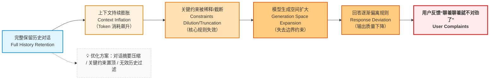

在讨论“记忆”之前，我们必须先回答一个**技术决策层面的问题**：

> **当用户开始连续提问时，我们是否应该“尽量多地保留历史对话”？**

很多团队在这个问题上的直觉答案是：

> *当然要保留，历史越完整，模型越能理解上下文，回答自然更准确*

但这一章要做的事情，正是**推翻这个直觉** —— 因为 “全量保留历史” 不仅无法解决问题，反而会埋下系统失控的隐患。

---

### 6.1 一个常被忽略的事实：上下文不是记忆

在 LLM 的 API 交互中，我们通常通过 messages 参数传入对话历史，格式类似这样：

```json
[
  {"role": "system", "content": "..."},
  {"role": "user", "content": "..."},
  {"role": "assistant", "content": "..."}
]
```

这很容易让人产生一个工程误判：

> “只要我把历史消息都塞进去，模型就能记住一切。”

但如果回到第一部分对 LLM 本质 —— **`token`序列的概率预测模型** —— 的分析，你会发现：

- 模型接收的所有上下文（包括系统提示、用户提问、历史回答）会被**一次性拼接成一个长 `token` 序列**（比如上述示例会变成 “`<system>`你是企业知识库助手...`<user>`请问年假怎么申请？`<assistant>`需通过 OA 系统...”）
- 它并不知道哪些是“历史”，哪些是“当前”（即它只会基于整个序列的统计规律预测下一个 token）
- 更不知道哪些信息**在工程上更重要**（比如 “仅回答内部政策”），哪些是 “临时的无关信息”。

因此，一个关键认知是：

> **上下文只是输入数据，而不是记忆机制。**

人类的记忆会主动筛选、分层、关联信息，而上下文只是无序的信息堆砌。

---

### 6.2 上下文窗口的三个硬限制（为什么“全塞进去”一定会失败）

即使你愿意无条件保留所有历史，对话系统也会很快撞上三个不可绕过的限制：

1. **长度上限**：超过窗口，信息会被直接截断

所有 LLM 都有明确的 token 长度限制（比如 GPT-3.5 为 4k token，GPT-4 基础版为 8k token，增强版为 128k token）。当历史对话累积的 token 数超过这个上限时，系统只能通过 “截断” 处理（通常是删除最早的内容），这会直接导致早期关键信息（比如系统约束）丢失。举例：如果系统提示包含 

*“禁止回答外部政策”，但随着对话变长，这条约束被挤出窗口，模型就可能开始回答无关内容。*

2. **注意力衰减**：越靠前的信息，影响力越弱

*举例：用户在第 1 轮提到 “我是市场部员工”，到第 10 轮询问报销政策时，模型可能已经 “忽略” 了这个身份信息，给出了不适用的规则。*

3. **成本与延迟**：token 越多，系统越慢、越贵

LLM 的调用成本（按 token 计费）和响应延迟与上下文长度正相关。全量保留历史会导致每轮对话的 token 数持续增长，直接推高系统成本（可能是初始成本的 10 倍以上），同时延长用户等待时间（从几百毫秒增至几秒）。


这些限制最终会导致一个危险的后果：

> **最早写下的系统约束（比如 “仅用知识库内容回答”“不泄露隐私”），反而最先失效。**

---

### 6.3 技术决策的失败路径：对话为什么会“慢慢跑偏”？


当我们坚持 “全量保留历史对话” 时，对话系统会沿着一条可预见的路径逐渐失控，我们可以用一个流程图来理解这个过程：




这并不是模型突然变差，而是系统在时间维度上**失去了对约束的控制权**。每一轮对话都会让关键规则的影响力减弱一分，直到最后完全失效。

*比如，一个初始设定为 “仅回答薪酬相关问题” 的助手，在多轮对话后可能会开始回应 “公司地址”“产品价格” 等无关内容 —— 不是它 “忘记” 了规则，而是规则在上下文序列中被稀释到几乎无法影响预测结果。*

---

### 6.4 本章小结：一个必须接受的结论

通过本章的分析，我们可以得出一个明确的结论：

- “尽量保留所有上下文”是一个**工程反模式(Anti-pattern)**，它会导致约束失效、成本飙升、体验下降。
- 上下文窗口无法承担“长期记忆”的职责，其本质上是 “一次性输入缓冲区”

既然全量保留不可行，那自然会引出下一个问题：

> **如果不能无脑堆上下文，那我们到底该保留什么？**

这正是下一章要解决的核心问题 —— 从 “被动堆积上下文” 转向 “主动管理上下文”。
