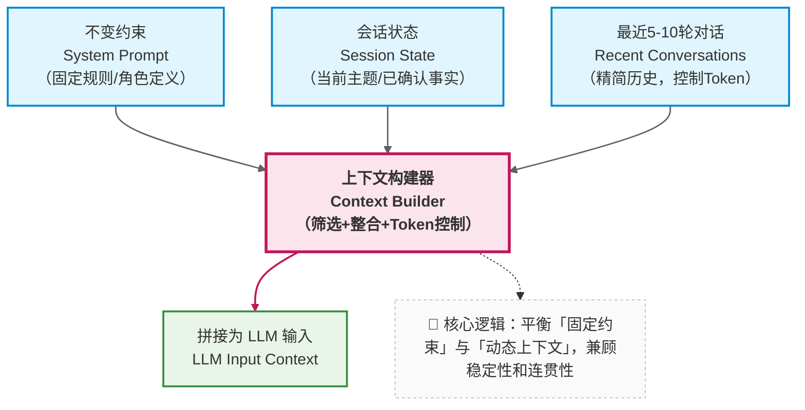

在前两章中，我们已经完成了两个关键决策：

- 否定“无限上下文”的幻想
- 接受“信息必须被分层管理”

接下来，我们需要面对一个更系统级的问题：

> **“记忆”是否应该只有一种实现方式？**

答案是否定的。

---

### 8.1 技术决策视角：记忆不是功能，而是策略组合

在很多产品讨论中，“给系统加记忆” 常被当作一个简单的功能点（比如 “让模型记住之前说过的话”）。但从工程角度看，记忆是**一组需要根据场景动态调整的策略** 

—— 不同的信息生命周期（几秒、几小时、几天）、不同的重要性，需要匹配不同的记忆方式。

比如：

- *用户当前的提问意图（“我在问报销流程”）需要 “即时记忆”，确保下一句回应不跑偏；*
- *已确认的用户身份（“市场部员工”）需要 “会话级记忆”，在整个对话过程中保持一致；*
- *三个月前用户咨询过的 “差旅政策” 需要 “长期记忆”，在用户再次提问时能快速关联。*

这些不同场景的需求，无法通过单一的 “记忆功能” 满足，必须设计分层的记忆策略。

---

### 8.2 短期记忆：受控的上下文拼接（什么时候足够用）

最基础、成本最低的记忆策略是 “短期记忆”，适用于单一会话内的近期交互（通常持续几分钟到 1 小时）。其核心设计是：

- 只保留最近 N 轮对话（N 的值根据模型窗口大小确定，通常为 5-10 轮）；
- 明确区分 `system` / `state` / `recent messages` 三个层级，按优先级拼接上下文




这个策略的工程价值在于：

- **行为可预测**：由于只保留有限内容，token 数量可控，不会突然触发截断；
- **成本可控**：避免了全量历史导致的 token 爆炸，调用成本稳定；
- **实现简单**：无需复杂的存储或摘要逻辑，仅需维护一个滑动窗口。

但它很快会遇到边界：

> **当对话跨越更长时间或主题切换频繁时，仅靠短期记忆会导致状态丢失**

例如，用户上午讨论 “年假政策”，下午继续对话时，系统可能已经忘记上午确认的 “用户入职满 3 年” 这一关键信息。

---

### 8.3 中期记忆：由 LLM 维护的状态摘要（为什么要引入）

为了避免重要状态被挤出窗口，企业知识库助手通常会引入 “中期记忆”—— 通过“会话状态摘要”来持久化关键信息，确保在对话持续数小时或主题切换时，核心状态不丢失。

会话状态摘要的核心不是 “总结对话内容”，而是**记录 “已确认的决策信息”**，格式通常是结构化的键值对或列表。

```text
【会话状态摘要】
- 当前用户：张三（市场部，入职时间2021年3月）
- 讨论主题：2025年新版差旅报销政策
- 已确认事实：
  1. 国内差旅住宿上限为一线城市800元/晚，二线600元/晚
  2. 高铁二等座可全额报销，一等座需部门负责人审批
- 待确认问题：
  1. 海外差旅是否适用此政策？
  2. 报销时效是否仍为3个月？
```

这类摘要的维护机制通常是：**每轮对话结束后，调用 LLM 对比新内容与当前摘要，自动更新关键信息**（新增确认项、移除已解决问题、修正错误）。


它的核心价值是：**将分散在多轮对话中的关键信息 “浓缩固化”，避免被短期记忆的滑动窗口 “挤出”**。

即使短期记忆只保留最近 5 轮，状态摘要也能确保 “用户身份”“已确认规则” 等信息持续影响模型决策。

> 这不是对话摘要，而是**决策状态的持久化**。

---

### 8.4 长期记忆：为什么不能继续塞进上下文？

当对话场景扩展到以下情况时，仅靠短期和中期记忆（依赖上下文窗口）就会变得不现实：

- **跨天对话**：用户今天咨询一半，明天继续；
- **多任务切换**：用户同时处理 “报销”“年假”“绩效” 多个主题；
- **多用户并发**：同一个助手服务多个员工，需要区分每个人的历史。

此时，继续将所有信息塞进上下文窗口会导致两个问题：

1. 窗口容量有限，无法容纳多天的状态摘要；
2. 不同用户 / 任务的信息混杂，导致模型混淆。

因此，我们需要一种 “移出上下文但可按需召回” 的记忆机制 —— 这正是**长期记忆**的核心价值。

长期记忆的实现通常依赖外部存储（如数据库、向量数据库），其核心逻辑是：

- 将不活跃的会话状态（如 24 小时未更新）从上下文移出，存入外部存储；
- 当用户再次激活对话时，通过检索（如基于用户 ID、主题关键词）将相关历史状态重新导入上下文。


> **长期记忆的核心不是 “记住一切”，而是 “在需要时，能把正确的信息带回上下文”** —— 它解决的是 “跨时间、跨规模” 的记忆问题。

此时，一个新的技术出现了：这正是`向量检索`、`RAG`等机制存在的根本原因。

---

### 8.5 本章小结：记忆层次决定系统上限

通过本章的分析，我们可以明确：企业知识库助手的 “记忆” 是分层的策略组合，不同层次解决不同问题：

- 短期记忆：通过受控的上下文拼接，解决 “当前几轮对话的连贯性”；
- 中期记忆：通过状态摘要，解决 “会话级关键信息的一致性”；
- 长期记忆：通过外部存储与检索，解决 “跨时间、跨任务的信息召回”。

这三层记忆共同构成了系统在时间维度上的可靠性基础。但还有一个关键问题尚未解决：

> *当用户的问题超出模型自身的知识范围（比如最新的公司政策），仅靠记忆策略如何保证回答准确？*

而这自然引出了下一部分的讨论主题：我们将深入探讨 RAG（检索增强生成）技术如何与上下文工程结合，让系统的知识边界可控、可扩展。
