在前面的章节中，我们已经反复提到几个现象：

* Prompt 写得再好，对话一长就会失控
* 模型能力没有变，但系统表现却越来越差
* 用户的问题越来越“合理”，模型却越来越“跑偏”

这些问题，**几乎都不是模型问题，也不是 Prompt 问题**。 —— Prompt 解决的是 “单次生成的约束”，模型解决的是 “概率预测的能力”，而它们共同忽略了多轮对话的核心挑战：**时间维度上的信息管理。**

它们指向的是同一个核心能力：

> **上下文工程（Context Engineering）**

这门技术看似简单（“管理对话历史”），实则是区分 “玩具级应用” 和 “生产级系统” 的关键 —— 它决定了你的 LLM 应用能在真实场景中 “跑多远”。

---

### 9.1 什么是上下文工程？（不是“多轮对话”）

很多人第一次听到“上下文工程”时，会把它简单理解为：

* 维护聊天历史
* 把之前的对话一起传给模型

但这只是**最表层、也是最危险的一种理解**。

更准确的定义是：

> **上下文工程，是一门关于「在有限窗口内，如何持续、可控地向模型注入信息」的工程学科。**

它关注的不是“聊了多少轮”，而是 “每一轮该让模型看到什么”—— 具体来说，是四个关键决策：

* **哪些信息必须一直存在**：比如系统的核心约束、用户的关键身份信息，这些是维持系统行为一致性的基础；
* **哪些信息可以被遗忘**：比如对话中的寒暄、临时追问的无关细节，这些信息对后续决策毫无价值；
* **哪些信息需要被压缩、总结、重写**：比如多轮对话中形成的共识（“用户是销售部员工”），无需保留完整对话，只需提炼核心结论；
* **哪些信息应该永远不进入上下文**：比如敏感数据（用户手机号）、无效反馈（“谢谢”“好的”）、潜在风险内容（恶意引导的提问）。

举个直观的例子：

企业知识库助手的对话中，

- “仅回答内部政策，禁止泄露未公开信息” 必须一直存在；
- 用户说的 “我再想想” 可以被遗忘；
- “我是销售部的，经常出差” 需要总结为 “用户：销售部，高频出差”；
- 用户误输入的手机号应该直接过滤，不进入上下文。

上下文工程的本质，是对模型的输入进行 “主动治理” —— 而不是被动接受对话的自然增长。

---

### 9.2 为什么“自然增长的上下文一定会失败？”

让我们先看一种**几乎所有新手都会采用的方式**：

```text
用户问一句
模型答一句
全部原样塞回上下文
```

这种方式在前几轮对话中表现良好，但它**从工程角度看是必然失败的**。

前面也提到过，原因有三点：

1. 窗口有限 vs 信息无限增长
2. 不同信息的“重要性”并不相同 vs 模型平等对待
3. 模型无治理能力 vs 信息需动态调整

更危险的是，这种 “自然增长” 的方式会让问题 “延迟爆发”：前几轮看似正常，等对话达到一定长度后，错误会集中出现，且很难定位问题根源（是哪一轮的信息导致了偏差？）。


因此，上下文工程的核心前提是：**放弃 “全量保留” 的幻想，转向 “精准筛选” 的主动设计**。

---

### 9.3 上下文工程的核心思想：分层，而不是堆叠

成熟的 LLM 系统都会隐含一个共识：

> **上下文不是一条时间线，而是一组“职责不同的信息层”。**

一个通用、但非常重要的抽象可以表示为：

```mermaid
graph TD
    %% 样式定义：沿用分类配色，强化节点区分
    classDef inputNode fill:#e1f5fe,stroke:#0288d1,stroke-width:2px,rounded:10px
    classDef coreNode fill:#fce4ec,stroke:#c2185b,stroke-width:3px,rounded:10px,font-weight:bold
    classDef llmNode fill:#e8f5e8,stroke:#388e3c,stroke-width:2px,rounded:10px,font-size:14px
    classDef noteNode fill:#fafafa,stroke:#bdbdbd,stroke-dasharray:3 3,rounded:8px

    %% 输入节点：横向并列，视觉对称
    A[长期不变的系统约束<br/>System Constraints<br/>（角色/规则/权限）]:::inputNode --> F[上下文构建器<br/>Context Builder<br/>（筛选+整合+Token控制）]:::coreNode
    B[跨轮对话的状态摘要<br/>Cross-turn State Summary<br/>（核心结论/未完成事项）]:::inputNode --> F
    C[最近对话内容<br/>Recent Conversation<br/>（精简5-10轮，控制长度）]:::inputNode --> F
    D[外部注入的知识/工具结果<br/>External Knowledge/Tool Results<br/>（数据库查询/API返回/文档片段）]:::inputNode --> F

    %% 核心输出：指向LLM
    F --> G[LLM<br/>（接收融合后的完整输入）]:::llmNode

    %% 补充注解：点明核心价值
    note[📌 核心逻辑：多源信息融合，让LLM兼具「上下文连贯性」与「外部知识能力」]:::noteNode
    F -.-> note 

    %% 箭头样式：强化层级关系
    linkStyle 0 stroke:#616161,stroke-width:1.5px
    linkStyle 1 stroke:#616161,stroke-width:1.5px
    linkStyle 2 stroke:#616161,stroke-width:1.5px
    linkStyle 3 stroke:#616161,stroke-width:1.5px
    linkStyle 4 stroke:#c2185b,stroke-width:2.5px,stroke-dasharray:0 0 
```




这张图背后隐藏着几个关键设计决策,也是上下文工程的核心价值所在：

1. 每层信息都有明确的 “职责边界”

  - **长期不变的系统约束**：负责 “定规矩”，回答 “系统永远不能做什么、必须遵守什么”，是整个系统的 “行为底线”；
  - **跨轮对话的状态摘要**：负责 “记关键”，回答 “对话到目前为止，有哪些确定的事实、未解决的问题”，是维持连贯性的核心；
  - **最近 N 轮对话内容**：负责 “保流畅”，回答 “用户刚刚问了什么、系统刚刚答了什么”，避免对话脱节；
  - **外部注入的知识 / 工具结果**：负责 “补信息”，回答 “当前问题需要哪些额外知识 / 数据”，是解决特定问题的临时补充。

2. 每层信息都有明确的 “优先级”

  - 当上下文窗口接近 token 上限时，遵循 “先砍低优先级，再保高优先级” 的原则：
  - 绝对不砍：长期不变的系统约束；
  - 尽量保留：跨轮对话的状态摘要；
  - 可动态截断：最近 N 轮对话内容（比如从 10 轮砍到 5 轮）；
  - 按需筛选：外部注入的知识 / 工具结果（比如只保留与当前问题相关的片段）。

3. 每层信息都有明确的 “更新规则”

  - 系统约束：仅在业务规则变更时更新（比如公司政策调整），平时固定不变；
  - 状态摘要：每轮对话结束后更新（新增确认事实、移除已解决问题、修正错误信息）；
  - 最近 N 轮：每轮对话后自动滑动，移除最早的内容；
  - 外部知识：随当前问题动态注入，问题解决后不保留（避免占用窗口）。

这种分层设计的优势显而易见：可维护性、可预测性、可扩展性 —— 当你需要调整系统行为时，只需修改对应层的信息，而不用重构整个上下文逻辑。

---

### 9.4 上下文工程 ≠ Prompt 工程

这是一个非常容易混淆、但必须区分清楚的点。

| 维度   | Prompt 工程 | 上下文工程     |
| ---- | --------- | --------- |
| 关注点  | 单次调用的行为约束 | 跨调用的信息演进  |
| 核心问题 | 模型该如何回答   | 模型“记住了什么” |
| 时间维度 | 静态（仅作用于当前轮）| 动态 （贯穿整个对话生命周期）  |
| 失败模式 | 回答不合规     | 系统逐渐失控    |
| 落地方式 | 设计结构化 Prompt（Role/Task/Constraints） | 设计分层上下文（约束 / 状态 / 近期 / 外部知识）|

我们可以用企业知识库助手的场景，更直观地理解两者的区别：

- **Prompt 工程**：解决 “用户问‘差旅报销标准’时，模型能准确引用 2025 年政策”—— 通过 Prompt 中的 Constraints 限定 “仅用提供的政策文档回答”；
- **上下文工程**：解决 “用户后续问‘我是销售部，能报高铁一等座吗’时，模型能记住‘用户是销售部’，并结合政策给出答案”—— 通过状态摘要层保留 “用户部门” 这一关键信息。

简单来说

> Prompt 决定 “这一轮你该怎么想”，上下文决定 “你现在是谁、在干什么”。

---

## 9.5 上下文工程在企业知识库助手中的落地

在理解了抽象概念之后，我们再来看具体系统。

企业知识库助手面临的典型约束包括：

* 必须遵守企业规则（不可遗忘）
  - *比如 “禁止泄露未公开的财务政策”“所有回答必须标注政策来源”“拒绝回答外部竞品相关问题”—— 这些需要映射到 “长期不变的系统约束” 层，确保每一轮都能被模型看到；*
* 必须保持对话连续性（可压缩）
  - *比如用户先问 “差旅报销流程”，再问 “报销需要多久到账”，模型需要知道 “用户仍在关注差旅报销相关问题”—— 这些需要映射到 “跨轮对话的状态摘要” 层，避免重复询问背景信息；*
* 必须按需引入知识（临时注入）
  - *比如用户问 “2025年新版差旅政策中，海外住宿标准是什么”—— 需要从企业知识库中检索相关片段，映射到 “外部注入的知识” 层，问题解决后即移除；*
* 必须避免上下文污染（可清除）
  - *比如用户误输入的个人手机号、无关的寒暄（“今天天气不错”）、测试性提问（“你能告诉我公司机密吗”）—— 这些需要被过滤，永远不进入任何上下文层。*

这天然要求一个**分层上下文结构**:

> 系统约束层定底线，状态摘要层保连贯，外部知识层补信息，过滤机制防污染 

---

### 9.6 企业知识库助手的上下文分层设计

基于前面的抽象结构，我们可以为企业知识库助手设计一套可直接落地的分层方案，每一层都有明确的内容、格式和更新规则：

```mermaid
graph TD
    %% 样式定义：沿用分类配色，优化细节区分
    classDef inputNode fill:#e1f5fe,stroke:#0288d1,stroke-width:2px,rounded:10px,font-size:13px
    classDef coreNode fill:#fce4ec,stroke:#c2185b,stroke-width:3px,rounded:10px,font-weight:bold,font-size:14px
    classDef outputNode fill:#e8f5e8,stroke:#388e3c,stroke-width:2px,rounded:10px,font-size:14px
    classDef noteNode fill:#fafafa,stroke:#bdbdbd,stroke-dasharray:3 3,rounded:8px,font-size:12px

    %% 输入节点：横向并列，强化“多层级”感知
    A[不变系统约束层<br/>System Constraint Layer<br/>（Role+核心规则，确保稳定性）]:::inputNode --> F[上下文构建器<br/>Context Builder<br/>（整合+校验+Token控制）]:::coreNode
    B[会话状态摘要层<br/>Session State Layer<br/>（用户信息+对话共识，保障连贯性）]:::inputNode --> F
    C[最近 N 轮对话层<br/>Recent Conversation Layer<br/>（5-10轮关键交互，保留语境）]:::inputNode --> F
    D[检索知识注入层<br/>Retrieval Knowledge Layer<br/>（政策片段+来源标注，提升准确性）]:::inputNode --> F

    %% 最终输出：明确指向 LLM 输入
    F --> G[LLM 最终输入<br/>Final LLM Input<br/>（结构化+可控 Token 范围）]:::outputNode

    %% 核心注解：点明多层级融合价值
    note[📌 核心逻辑：多层级信息分层注入，兼顾稳定性、连贯性、准确性]:::noteNode
    F -.-> note  

    %% 箭头样式：强化层级关系与核心链路
    linkStyle 0 stroke:#616161,stroke-width:1.5px,stroke-linecap:round
    linkStyle 1 stroke:#616161,stroke-width:1.5px,stroke-linecap:round
    linkStyle 2 stroke:#616161,stroke-width:1.5px,stroke-linecap:round
    linkStyle 3 stroke:#616161,stroke-width:1.5px,stroke-linecap:round
    linkStyle 4 stroke:#c2185b,stroke-width:2.5px,stroke-linecap:round
```




这里每一层都有明确职责：

#### 1. 不变系统约束层（最高优先级）

- **核心内容**：明确系统角色、行为边界、安全规则，格式固定，不随对话变化；
- **示例写法**：
  ```text
  你是XX公司内部知识库助手，仅为员工提供政策咨询服务。
  核心规则：
  1. 仅使用提供的企业政策文档回答，禁止引入外部知识、常识或个人推断；
  2. 所有回答必须标注政策来源（如《2024差旅政策》3.2条），无明确来源的信息需回答“不知道”；
  3. 禁止泄露未公开政策、员工个人信息、商业机密；
  4. 拒绝回答与公司政策无关的问题（如竞品信息、私人问题）。
  ```
- **更新规则**：仅当公司政策发生重大变更时手动更新，平时永久固定。

#### 2. 会话状态摘要层（中高优先级）

- **核心内容**：提炼对话中“对后续决策有用的关键信息”，结构化存储，避免冗余；
- **推荐字段**：
  ```text
  【会话状态】
  - 用户信息：姓名（可选）、部门（销售部）、核心诉求（咨询2024差旅报销相关问题）；
  - 已确认事实：1. 用户需频繁出差至华东地区；2. 已了解国内差旅住宿标准（一线城市800元/晚）；
  - 待解决问题：1. 海外差旅住宿标准；2. 报销审批时效；
  - 已拒绝需求：无（未涉及无关问题）。
  ```
- **更新规则**：每轮对话结束后，调用 LLM 对比新交互内容与当前状态，自动新增/修改/删除字段（比如用户解决“审批时效”后，从“待解决”移至“已确认”）。

#### 3. 最近 N 轮对话层（中低优先级）

- **核心内容**：保留最近5-10轮的关键交互，过滤寒暄、重复提问等无效信息；
- **N 值选择依据**：
  - 模型窗口大小（比如 GPT-3.5 4k token 选5轮，GPT-4 8k token 选10轮）；
  - 对话密度（文字密集型对话选5轮，短句交互选10轮）；
- **示例片段**：
  ```json
  [
    {"role": "user", "content": "我是销售部的，经常去上海出差，想了解2024年差旅报销标准"},
    {"role": "assistant", "content": "根据《2024差旅政策》3.2条，国内一线城市住宿标准为800元/晚，上海属于一线城市，你可按此标准报销"}
  ]
  ```
- **更新规则**：每轮对话后自动滑动，移除最早的内容；当 token 接近上限时，优先保留用户提问和核心回答，过滤无关细节。

#### 4. 检索知识注入层（临时优先级）

- **核心内容**：仅当当前问题需要特定政策片段时注入，格式规范，标注来源；
- **示例写法**：
  ```text
  【参考知识】
  来源：《2024差旅政策》4.3条
  核心内容：海外差旅住宿标准按目的地国家/地区分级，欧美发达国家为1500元/晚，东南亚国家为1000元/晚，需提前3个工作日提交出差申请。
  ```
- **更新规则**：随当前问题动态注入，下一轮对话若不涉及相关主题，自动移除；若涉及同一主题，可更新补充新的知识片段。

---

### 9.7 一个最小可用的上下文构建示例（伪代码）

基于上述分层设计，我们可以实现一个最小可用的上下文构建函数。这段代码的核心不是语法，而是背后的工程思想——每一步都体现了“分层、可控、动态”的原则：

```python
def build_context(
    system_constraints: str,  # 不变系统约束层（必传）
    conversation_state: str,  # 会话状态摘要层（可选，默认空）
    recent_messages: list,    # 最近N轮对话层（必传）
    retrieved_docs: str       # 检索知识注入层（可选，默认空）
) -> list:
    """
    构建企业知识库助手的LLM输入上下文
    设计原则：高优先级信息前置，低优先级信息动态调整
    """
    messages = []

    # 1. 不变系统约束层：用system角色确保最高优先级，不被注意力衰减影响
    messages.append({
        "role": "system",
        "content": f"【系统约束】\n{system_constraints}"
    })

    # 2. 会话状态摘要层：同样用system角色，紧跟约束之后，确保模型优先读取
    if conversation_state.strip():
        messages.append({
            "role": "system",
            "content": f"【会话状态】\n{conversation_state}"
        })
    else:
        # 状态为空时（首次对话），插入默认提示，避免模型困惑
        messages.append({
            "role": "system",
            "content": "【会话状态】\n用户为新用户，尚未确认关键信息，需根据提问逐步补充。"
        })

    # 3. 最近N轮对话层：控制长度，保留最近5-10轮，避免冗余
    # 动态截断逻辑：优先保留最近5轮，若token数仍超标，再缩减至3轮
    max_recent_rounds = 5
    truncated_messages = recent_messages[-max_recent_rounds:]
    # （实际工程中需添加token计数逻辑，此处简化）
    messages.extend(truncated_messages)

    # 4. 检索知识注入层：按需注入，用system角色标注，明确为参考资料
    if retrieved_docs.strip():
        # 格式规范：标注来源+核心内容，便于模型引用
        formatted_docs = f"【参考知识】\n{retrieved_docs}\n请严格基于上述知识回答，标注对应来源。"
        messages.append({
            "role": "system",
            "content": formatted_docs
        })

    # 工程关键：返回前检查总token数，确保不超过模型窗口上限
    # （实际工程中需添加token计算和截断逻辑，优先砍检索知识和最近对话）
    return messages
```

说明：

1. **角色选择技巧**：系统约束和状态摘要用`system`角色，而不是`user`或`assistant`——因为`system`角色的信息在模型处理中优先级更高，能有效抵抗注意力衰减；
2. **动态截断逻辑**：最近对话的“N轮”不是固定值，而是根据token数动态调整，避免硬编码导致的窗口溢出；
3. **异常处理**：考虑到“首次对话无状态”“无检索知识”等场景，补充默认逻辑，避免模型因输入不完整而产生幻觉；
4. **格式规范**：每层信息都有明确的标签（【系统约束】【会话状态】），帮助模型区分不同类型的信息，减少混淆。


重点注意，这段代码真正重要的不是“怎么写”，而是它体现的原则：

> **上下文是被设计出来的系统结构，而不是副产品。**

---

### 9.8 本章小结：上下文工程决定系统“能跑多远”

通过这一章，你应该已经形成这样的核心认知：

* 多轮对话失控不是偶然，也不是“Prompt 技巧不足”，而是**上下文没有被当作一等工程对象来设计**——没有分层、没有优先级、没有动态管理，让低价值信息挤占了高价值信息的生存空间；
* 上下文工程的本质是“信息治理”：通过分层设计，让系统约束“不被遗忘”、对话共识“不被稀释”、冗余信息“不被保留”、外部知识“按需注入”；
* 落地上下文工程的关键，是配套三大机制：**分层信息定义机制**（明确每层内容）、**状态动态更新机制**（每轮刷新摘要）、**长度监控截断机制**（避免窗口溢出）。

但你也应该意识到一个新的边界：

> 即使上下文被精心管理，系统依然只能回答“模型已知或上下文已提供”的内容。

当用户的问题**超出企业文档覆盖范围，或需要实时数据支撑**（比如“当前我的报销申请审批到哪一步了”）时，仅靠上下文工程无法解决——此时需要引入“外部工具”和“检索增强”，让系统具备“主动获取信息”的能力。

下一部分，我们将聚焦 RAG（检索增强生成）与工具调用，探讨如何让企业知识库助手从“只能回答已知问题”，升级为“能解决未知问题”。