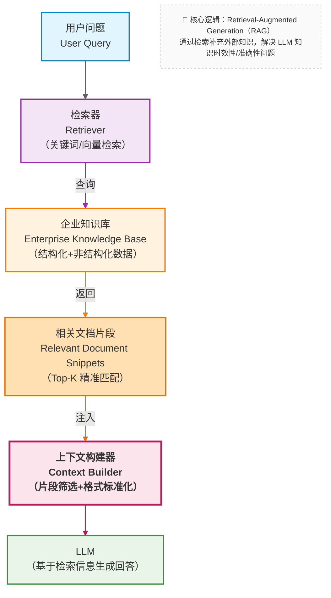

RAG（Retrieval-Augmented Generation）通常被介绍为：

> *在生成前检索相关知识，作为上下文提供给模型。*

这个定义并没有错，但它隐藏了真正重要的工程价值。

---

### 11.1 一个更准确的工程视角

从系统设计角度，RAG 的核心作用可以被描述为：

> **在生成前，动态构造一个“最小且相关的知识上下文”。**

请注意两个关键词：

- **动态**：每次问题都不同，检索的知识也不同（比如用户问 A 产品时找 A 的文档，问 B 产品时找 B 的文档）
- **最小**：只注入必要信息（比如用户问 “A 产品的定价”，就只塞定价相关的片段，而非整份产品手册）

这正好弥补了上下文窗口的先天不足：不再需要把所有知识塞进窗口，而是只在需要时 “临时调取” 相关部分，既避免了窗口溢出，又减少了注意力竞争。

举个实际场景：

- 企业知识库有 1000 份文档（总大小 100 万 tokens）
- 用户问：“新员工入职流程中，需要提交哪些材料？”
- RAG 系统会：
  - 从 1000 份文档中检索出 “新员工入职手册 v2.3”
  - 从手册中提取出 “材料提交” 章节的第 3-5 段（共 500 tokens）
  - 把这 500 tokens 作为知识上下文传给模型
- 最终模型的输入是：行为约束（100 tokens）+ 相关知识（500 tokens）+ 用户问题（50 tokens），总大小 650 tokens，远低于窗口限制。

---

### 11.2 RAG 在企业知识库助手中的位置

在这个结构中，每个模块的职责被清晰拆分：

- **检索器：**负责 “找知识”。输入用户问题，输出最相关的文档片段（比如通过向量相似度计算、关键词匹配等方式）。
- **企业知识库：**负责 “存知识”。以结构化 / 非结构化形式存储所有文档（比如拆分成 Chunk 后，用向量数据库存储）。
- **上下文构建器：**负责 “拼上下文”。把检索到的知识片段、行为约束、用户问题整合成模型能理解的输入格式。
- **LLM：**负责 “生成回答”。基于构建好的上下文，输出符合约束的结果。

简单来说：

- Prompt 负责约束
- Context Engineering 负责拼装
- RAG 负责**把正确的知识“带回来”**

---

### 11.3 一个关键结论

> **RAG 并不能保证“回答正确”，
> 但它能保证：
> 模型“有机会看到正确答案”。**

这听起来像是退步，但实际上是系统设计的关键飞跃：

- 从不可控 → 可控：以前模型回答错误可能是因为 “没见过正确信息”（无解），现在如果回答错误，至少可以定位到 “检索错了” 或 “模型没理解检索到的信息”（可优化）。
- 从玄学 → 工程问题：以前解决错误只能 “调 Prompt”“换模型”，现在可以通过优化检索策略、调整 Chunk 大小、完善知识库结构等可量化的工程手段改进。

理解了 RAG “动态构造最小相关知识上下文” 的本质后，另一个现实问题随之而来：为什么有些团队明明接入了 RAG，检索效果却始终不理想？是模型不够强，还是哪里出了更基础的问题？

答案往往藏在 RAG 流程的起点 —— 文档如何被处理成可检索的单元。