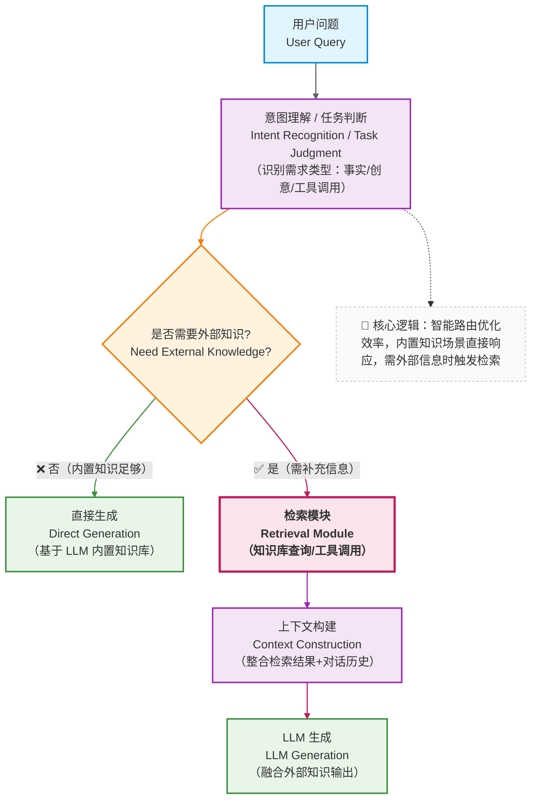
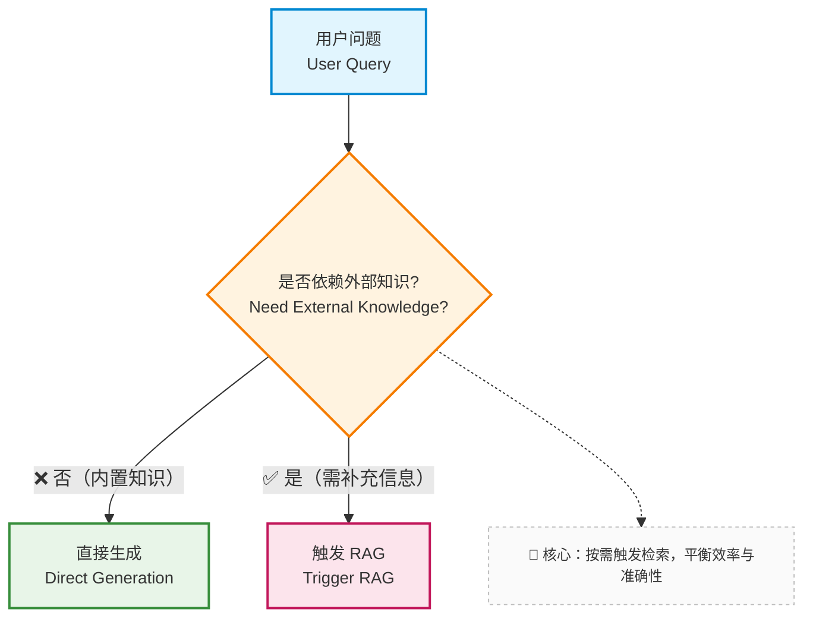
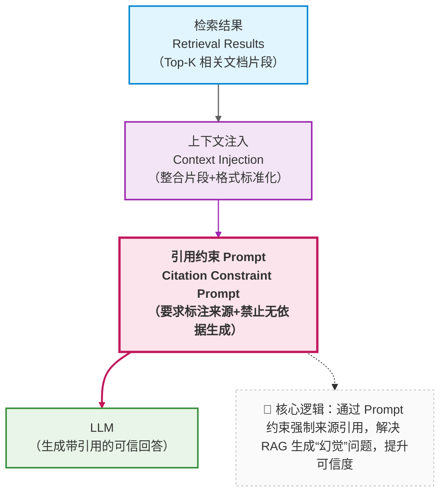
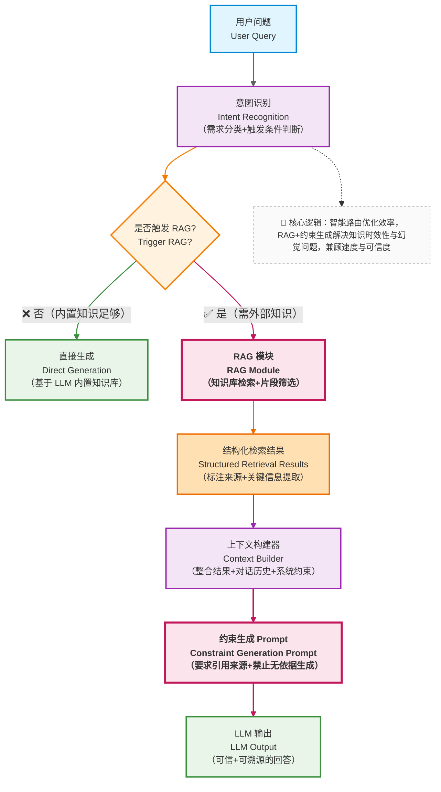

在前面的章节中，我们已经逐步解决了：

* 如何约束模型行为（Prompt）
* 如何管理对话与上下文（Context / Memory）

但到这里，一个更根本的问题开始浮现：

> **如果用户的问题，本身就超出了模型的知识边界，或者企业私有知识范围，系统还能做什么？**

这就是我们前面提到 RAG（Retrieval-Augmented Generation）存在的原因。

---

## 12.1 先别急着实现：什么是 RAG

在上一篇中，已经从工程的视角介绍了RAG: `动态构造一个“最小且相关的知识上下文”`

我们对齐进行展开

> **RAG 是一种：
> 在模型生成之前，
> 通过外部检索机制，
> 为模型“临时补充其本不具备的知识”的系统架构。**

注意几个关键词：

* **生成之前**
* **外部**
* **临时**
* **补充**

这意味着：

* 知识不进入模型参数
* 不依赖模型“记住”
* 不污染长期上下文

---

## 12.2 RAG 解决的，其实是“知识时效与边界问题”

为什么只靠模型本身一定不够？

在企业知识库助手中，典型问题包括：

* 企业制度频繁变化
* 内部流程不对外公开
* 文档体量远超上下文窗口
* 法规 / 合同 / SOP 有明确版本边界

这些问题有一个共同特征：

> **它们不是“模型不聪明”，而是“模型不可能知道”。**

RAG 的核心价值就在于：

> **把“知道什么”这个问题，从模型能力中剥离出来，交给系统解决。**

---

## 12.3 从系统角度看：RAG 在整体架构中的位置





从这里你可以看到：

* RAG 不是“总会发生”
* 它是一个**条件触发的系统能力**
* 并且发生在：

  > **上下文构建阶段，而不是 Prompt 阶段**

---

## 12.4 一个常见误区：RAG ≠ 万能增强器

在引入 RAG 后，很多团队会产生一个错误预期：

> *“只要接了 RAG，模型就不会胡说了。”*

现实往往相反：

* 检索结果不相关
* 模型曲解文档
* 回答看似“有依据”，但其实错误

这引出一个非常重要的事实：

> **RAG 的失败，大多数并不是发生在“生成阶段”，而是发生在“检索之前”。**


一旦你真正理解了 RAG 的系统定位，下一个、也是更残酷的问题就会出现：

> **为什么我已经“接了 RAG”，效果还是不好？**

很多失败的 RAG 项目，会把问题归因于：

* 向量模型不够好
* 大模型不够聪明

但在绝大多数情况下，真正的瓶颈出现在一个**更早、也更基础的地方**： —— 文档是“如何被拆解与表达的” 。 

就像用渔网捕鱼：如果网眼太大，小鱼会漏走；如果网眼太小，会被水草缠住。渔网的设计（对应 Chunk 设计），比 “用什么材质做渔网”（对应向量模型）更重要。

---

## 12.5 文档 → Chunk → Embedding：检索效果的真正上限

### 12.5.1 Chunk 设计：被严重低估的工程决策

Chunk（文档片段）是 RAG 的 “原子单元”—— 系统检索的是 Chunk，注入上下文的也是 Chunk。Chunk 的大小与切分方式，直接决定了：

* 能否被检索到：如果 Chunk 包含的信息与问题无关，再先进的检索器也找不到它；
* 被检索到后是否 “刚好有用”：如果 Chunk 太大，包含大量无关信息（噪声），模型会被干扰；如果太小，关键信息被切碎（比如一个流程的 “步骤 1” 和 “步骤 2” 被分到两个 Chunk），模型无法理解完整逻辑。

在企业知识库助手中，Chunk 设计的常见问题：

* Chunk 太大：
  * 典型场景：直接把整篇文档作为一个 Chunk（比如一份 10 页的产品手册）。
  * 问题：检索时容易 “误中”—— 比如文档里只有 1 段讲 “定价”，但因为整个文档被检索到，模型需要从 5000 字中找答案，很容易被其他内容干扰

* Chunk 太小：
  * 典型场景：按固定字数强制拆分（比如每 100 字切一段）。
  * 问题：语义被切碎 —— 比如 “审批流程需要部门经理签字后提交给 HR”，如果被拆成 “审批流程需要部门经理签字” 和 “后提交给 HR” 两个 Chunk，单独检索到任何一个都无法理解完整流程。

> **Chunk 设计，本质上是在做信息密度的权衡：既要让每个 Chunk 包含 “足够完整的语义”，又要避免 “包含过多无关信息”。**

---

### 12.5.2 一个工程化的 Chunk 决策思路

你可以从这样的问题开始思考：

* 用户的问题，通常对应文档的哪一层？是段落级？章节级？还是流程级？
* 文档本身的结构是什么？是否有天然的语义边界（比如标题、列表、表格）？

Chunk 应该尽量与 **“被提问的最小语义单元”** 对齐。举几个企业场景的例子：

- 场景 1：FAQ 文档（比如 “IT 支持常见问题”）
  - 特点：每个问题对应一个独立答案（比如 “如何重置密码？”→ 步骤 1-3）。
  - 最优 Chunk：按 “问题 + 答案” 成对切分（每个 Chunk 包含一个完整的问答）。
  - 理由：用户的问题往往直接匹配 FAQ 中的问题，精准切分能确保检索到的 Chunk 刚好包含答案。

- 场景 2：产品手册（比如 “CRM 系统操作指南”）
  - 特点：按功能模块划分章节（比如 “客户管理”→“新增客户”→“字段说明”）。
  - 最优 Chunk：按 “功能子模块” 切分（比如 “新增客户的 5 个必填字段” 作为一个 Chunk）。
  - 理由：用户的问题多是 “如何操作 XX 功能”，与子模块的语义边界高度匹配。

- 场景 3：会议纪要（比如 “Q3 销售策略会记录”）
  - 特点：包含多个讨论点（比如 “目标调整”“资源分配”“风险应对”）。
  - 最优 Chunk：按 “讨论主题” 切分（每个主题的讨论过程 + 结论作为一个 Chunk）。
  - 理由：用户可能问 “Q3 的销售目标是多少”，需要定位到 “目标调整” 主题的 Chunk。

此外，Chunk 的元数据（Metadata）也很重要 —— 比如给每个 Chunk 标记 “文档类型”“更新时间”“所属部门”，能帮助检索器进一步筛选（比如优先检索 “2024 年更新” 的文档）。

---

## 12.6 RAG工程化建设


### 12.6.1 从“调用 RAG”到“集成 RAG”：系统视角的转变

很多教程里的 RAG 看起来像这样：

```text
query → embedding → 向量检索 → 拼 prompt → 调模型
```

这在 Demo 中没问题，但在真实系统中，这种方式是不可持续的。

原因在于：

* RAG 不是一个**函数**
* 它是一个**长期存在的系统能力**

当我们需要集成RAG能力时，必须完成一个视角转变：

> **RAG 不是“我什么时候用一下”，而是“系统在什么条件下，必须依赖它”。**


### 12.6.2 RAG 的第一个工程问题：何时触发？

一个成熟系统，**不会对所有请求都使用 RAG**。

典型触发条件包括：

* 用户问题包含：

  * 企业私有名词
  * 内部流程 / 制度

* 问题涉及：

  * 时效性
  * 明确版本
* 模型置信度不足（如多次自我矛盾）




### 12.6.3 RAG 的第二个工程问题：接口如何定义？

在进阶系统中，RAG 模块不应该“直接拼 Prompt”，而应该返回一个**结构化结果**：

```json
{
  "documents": [
    {
      "id": "doc-123",
      "content": "...",
      "score": 0.87,
      "source": "HR-policy-v3"
    }
  ],
  "query_intent": "policy_explanation",
  "confidence": "high"
}
```

这样做的好处是：

* Prompt 构建不被 RAG 实现绑死
* 便于调试与评估
* 便于多模型 / 多策略切换

> **RAG 的输出，是系统资产，不是 Prompt 片段。**

### 12.6.4 RAG 的第三个工程问题：模型如何“被迫使用”检索结果？

这是**最容易被忽略、但最致命的一点**。

即使你检索回了正确文档，模型仍然可能：

* 忽略它
* 曲解它
* 混合自身知识胡说

因此你必须在系统层面做约束。

#### 一种常见的工程策略

```text
- 所有结论必须引用提供的文档
- 不允许基于“常识”补充
- 文档不足时，必须回答“不确定”
```




> **RAG 的成功，50% 取决于“生成约束”，而不是“检索准确率”。**

### 12.6.5 RAG 的第四个工程问题：失败如何被定位？

在应用的实际表现中，一定会遇到这个问题：

> *“现在效果不好，但我不知道是哪里出了问题。”*

一个可诊断的 RAG 系统，至少能回答：

* 是不是根本没召回？
* 召回的内容是否相关？
* 模型是否使用了召回内容？
* 回答是否超出了引用范围？

这要求你在系统中明确区分：

```text
检索失败 / 召回噪声 / 生成违约
```

否则，你永远只能“凭感觉调”。

### 12.6.6 企业知识库助手中的 RAG 集成示例

最后以企业知识库为例，我们看一下RAG的集成示例图




## 12.7 本章小结：RAG 是系统工程，而不是检索技巧

通过这一章，你应该已经形成一个完整认知：

* RAG 不是模型增强，也不是简单的“查资料”

而是：

> **一种用于突破模型知识边界的系统补偿机制。**

同时你也应该清楚地意识到：

* RAG 的效果上限，很早就被文档结构与数据工程决定了

这意味着：

> **RAG 是一个数据工程与系统设计问题，远早于它是一个模型问题。**

即便我们通过精心的 Chunk 设计为 RAG 打下了坚实基础，也无法完全避免检索失败的可能 —— 毕竟用户的问题可能天马行空，知识库的覆盖也总有边界。那么，当检索真的 “空手而归” 时，系统该如何应对才能避免陷入 “胡编乱造” 的陷阱？

