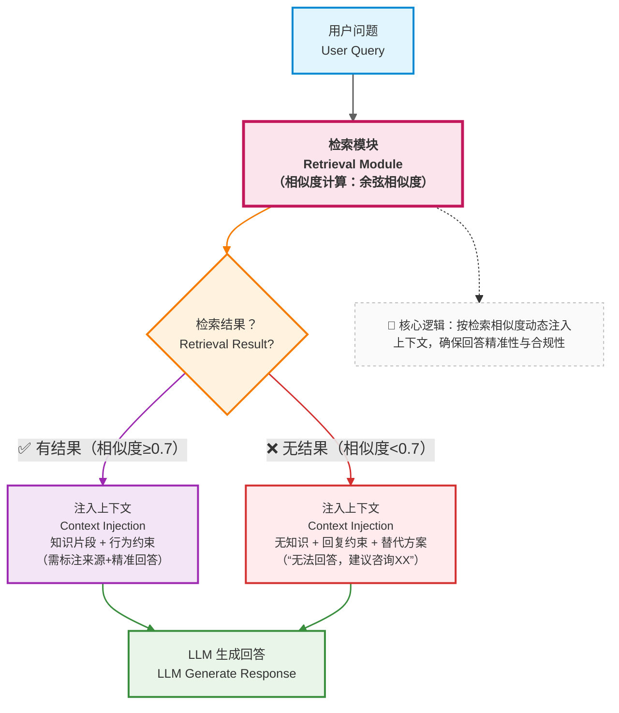

即使你设计了完美的 Chunk，检索依然可能失败。

- 用户的问题涉及 “尚未录入知识库的新政策”
- 问题表述模糊（比如 “那个蓝色的产品多少钱”，但知识库中没有 “蓝色产品” 的明确对应）
- 文档本身存在信息缺失

这时，一个新的技术决策问题出现了：

> **系统是否应该“硬着头皮回答”？**

---

### 13.1 一个危险但常见的默认行为

在没有检索到合适内容时，如果系统什么都不做（即直接把空的知识上下文传给模型）：

- LLM 会继续生成
- 幻觉会自然出现

这是企业知识库助手中**最危险的失效路径**。

- 对用户：得到错误信息（比如错误的报销流程、过期的产品价格），可能导致实际损失。
- 对系统：失去用户信任（“这个助手说的都不可信”）。

举个例子：用户问 “2025 年新入职员工的社保缴纳基数”，但知识库中只有 2024 年的政策。如果检索失败后系统硬答，可能会把 2024 年的基数当作 2025 年的返回，导致用户按错误标准准备材料，最终影响社保缴纳。

---

### 13.2 工程化的失败处理策略

在企业场景中，更合理的选择是：明确告知用户 “没有找到相关信息”，并提供替代方案。具体实现需要三个环节：

#### 1. 显式判断检索是否成功

设定 “检索成功阈值”：

- 向量检索：当最高相似度分数低于设定值（比如 0.7）时，判定为失败；
- 关键词检索：当匹配到的文档数量为 0，或匹配字段的覆盖率低于 30% 时，判定为失败；
- 混合判断：用小模型（如 GPT-3.5）快速扫描检索结果，判断是否与问题相关（成本稍高但更精准）。

#### 2. 将 “检索失败” 作为一种状态传入上下文

在构建上下文时，明确告知模型：“本次检索未找到相关信息，请回复‘暂无相关知识’，并建议用户联系 XX 部门获取帮助”。

#### 3. 提供具体的替代方案

避免简单回复 “不知道”，而是给出行动指引，比如：

- “抱歉，我暂时没有 2024 年社保缴纳基数的信息。你可以联系人力资源部（hr@company.com）获取最新政策。”
- “关于‘蓝色产品定价’，我没有找到明确信息。你可以补充产品型号（如 A100、B200），我会尽力为你查询。”

---

### 13.3 本章小结：RAG 的边界意识

- RAG 扩展了知识边界（让系统能回答超出自身训练数据的问题）
- 但并没有消除不确定性（总有检索不到的信息）

一个成熟系统的标志，不是“总能回答”，而是：

> **知道什么时候不该回答,以及不该回答时该做什么。**

这种 “边界意识” 能极大提升系统的可靠性 —— 用户会更信任一个 “只说确定信息” 的助手，而不是一个 “什么都敢说” 的助手。

---

## 第四部分总结：知识注入让系统第一次“接地气”

通过这一部分，你已经完成了一次关键升级：

- 从“依赖模型知识”（局限于训练数据截止前的公开信息）
- 到“按需注入外部事实”（可以回答企业内部的、实时的、专属的知识）

但你也应该已经意识到：

- 即使有了 RAG，系统仍然是被动的

它只能：

- 在被问到时检索（无法主动推送知识）
- 在给定的检索结果中生成回答（无法自主判断 “是否需要进一步找更多信息”）

这自然引出了下一部分的问题：

> **如果系统需要主动规划、多步决策，甚至自己决定“下一步该做什么”，该怎么办？**

下一部分，我们将进入：

> **Function Calling 与 Agent 的世界。**