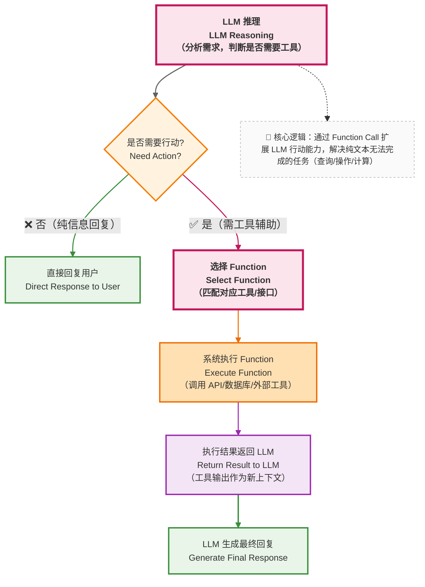

在很多介绍中，Function Calling 被描述为：

> *让模型调用外部函数。*

这个说法在概念上并没有错，但在工程上并不够准确。

---

### 15.1 一个更贴近系统设计的理解

从工程角度看，Function Calling 的作用是：

> **为模型提供一种“受约束的行动出口”。**

这句话可以拆成两个关键维度：

- **行动出口**：模型的 “思考” 需要转化为具体动作（比如 “查询文档”“调用审批系统”），Function Calling 就是这种转化的标准化格式 
  - —— 比如用`{"name":"search_document","parameters":{"doc_type":"travel_reimbursement","version":"2025"}}`表示 `查询 2025 版差旅报销文档`。

- **受约束**：模型不能随意定义动作，只能从系统预定义的函数列表中选择。比如如果系统没开放 “删除审批记录” 的函数，模型就无法发起这个操作 
  - —— 这在企业场景中至关重要（想象一下，如果模型能随意调用删除函数，会带来多大风险）。

---

### 15.2 Function Calling 在企业知识库助手中的位置

在这个流程中，权责划分非常清晰：

- LLM 负责“判断要不要做”: 是否需要行动？需要调用哪个函数？参数是否正确？
- 系统负责“真正去做”: 函数调用的实际操作（如查文档、调接口）由系统完成，模型不直接接触底层资源；
- 结果 “闭环”：执行结果会返回给 LLM，作为下一步推理的依据（比如查到文档后，模型再基于文档内容生成回答）。

举个例子：当用户问 “海外差旅报销是否需要主管审批” 时，

1. LLM 会先判断 “需要查询 2025 版文档”，然后调用`search_document`函数；
2. 系统执行查询后，将文档中 “审批环节” 的内容返回给 LLM；
3. 最后 LLM 基于这些内容，整理出对用户的回答。

---

### 15.3 一个关键工程结论

> **Function Calling 不是为了让模型更强，而是为了让系统更安全。**

它的核心价值，是把 “系统能做什么” 的控制权牢牢握在设计者手中：

- 想开放哪些能力（如查询、提交表单），就定义哪些函数；
- 想限制哪些风险（如修改数据、删除记录），就不提供对应的函数；
- 所有动作都有明确日志（哪个函数被调用、参数是什么），便于审计和调试。

理解了这一点，我们就能明白：为什么企业场景中，Function Calling 不是 “可选功能”，而是 “必选设计”

—— 它是模型 “智能” 与系统 “安全” 之间的平衡器。

但当任务变得更复杂（比如 “先确认报销流程，再帮我提交报销申请，最后同步给我的直属领导”），单次的 Function Calling 就不够了。

此时需要的，是能协调多个函数、多步操作的 “循环机制” —— 这就是我们接下来要讨论的 Agent。