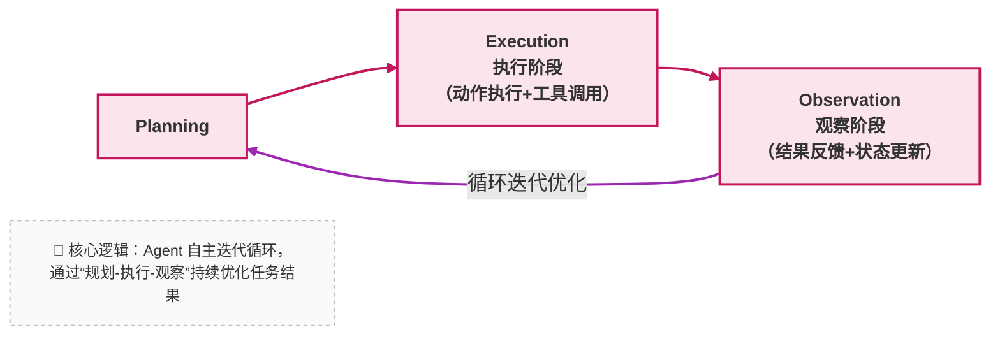

当系统需要处理的任务涉及：

- 多个工具（比如既需要查文档，又需要调用审批系统）
- 多个步骤（比如先确认规则，再填写表单，最后验证结果）
- 动态调整（比如提交失败后，需要根据错误提示修改内容）

单次的 Function Calling 就会力不从心。这时候，我们需要一种能 “持续决策、反复行动” 的机制 —— 这就是 Agent。

---

### 16.1 一个常见误解：Agent = 更复杂的 Prompt

很多人尝试实现 `Agent` 时，会陷入一个误区：认为只要写一个 “更详细的 Prompt”，让模型 “自己规划步骤”，就能实现 Agent 能力。

比如在 Prompt 里写 “你需要先查文档，再调用系统，最后整理结果”。

> **它们仍然在用“一次生成”的思维方式。**

没有真正的 “步骤执行与反馈”。实际使用中会出现各种问题：

- 模型可能 “忘记” 中间步骤（比如查了文档后，没调用审批系统就直接返回结果）；
- 无法处理意外情况（比如调用系统失败时，不知道该重试还是放弃）；
- 步骤不可控（比如本来 3 步能完成的任务，模型规划了 10 步，导致效率极低）。

这就是为什么很多 `Agent` 实现会失败：

> **它们把 “循环执行” 的逻辑交给了模型的 “一次性思考”，而没有在系统层面实现真正的闭环。**

---

### 16.2 Agent 的最小正确抽象

从系统视角看，一个能正常工作的 Agent 必须包含四个核心环节，形成闭环：

1. **思考（Planning）**：拆解任务，决定下一步要做什么（比如 “先查报销流程，再判断是否需要调用提交接口”）；
2. **行动（Execution）**：调用对应的工具 / 函数执行计划（比如调用search_document获取流程，调用submit_reimbursement提交申请）；
3. **反馈（Observation）**：获取行动结果（比如文档内容、接口返回的 “提交成功” 或 “缺少发票” 提示）；
4. **再规划（Replan）**：基于反馈调整下一步计划（比如如果提示 “缺少发票”，就规划 “提醒用户上传发票”）。

---

### 16.3 企业知识库助手中的 Agent 化形态

在我们的示例中，Agent 可以：

- **规划阶段**：用户问 “帮我处理这笔海外差旅报销”，Agent 拆解为 “1. 确认报销流程；2. 检查用户提供的信息是否完整；3. 调用提交接口；4. 通知主管”；
- **执行阶段**：先调用search_document获取流程，再调用check_info验证用户提供的发票、行程单等；
- **反馈阶段**：发现用户 “缺少电子行程单”，接口返回错误；
- **再规划阶段**：调整计划为 “先提醒用户补充电子行程单，再重新提交”。

这些决策逻辑不是写死在 Prompt 里的，而是 Agent 基于实时反馈动态生成的 

—— 这才是 “智能决策” 的核心：不是预设路径，而是根据实际情况灵活调整。

但这里有一个关键问题：如果 Agent 可以无限循环、自由决策，在企业场景中会带来巨大风险（比如反复调用付费接口导致成本失控，或执行未授权操作）。

因此，如何 “控制 Agent 的自由度”，成为下一章的核心话题。