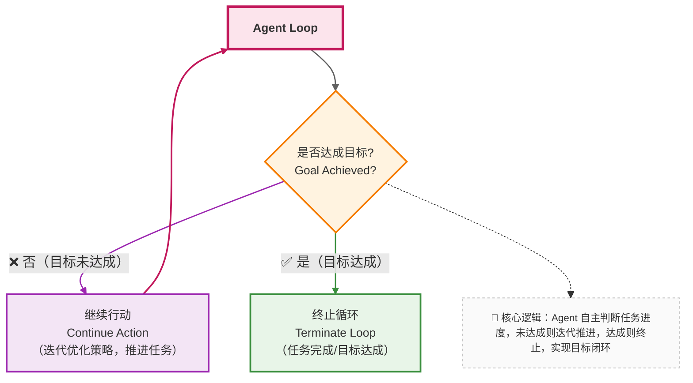

在 Agent 技术的热潮中，有一种危险的倾向：追求 “让 Agent 自主完成一切”，甚至赋予它 “近乎人类的自主权”。

但在企业场景中，这种 “放飞自我” 的 Agent 几乎一定会出问题 —— 合规性、成本、安全性都无法保障。

### 17.1 技术决策的核心问题

设计企业级 Agent 时，必须先回答一个问题：

> **Agent 的“自由度”，应该到哪里为止？**

如果不加控制，后果可能包括：

- **行为不可预测**：比如用户让 “处理报销”，Agent 可能擅自调用 “修改薪资系统” 的接口（即使这不在预期内）；
- **成本不可控**：为了完成一个简单任务，Agent 可能反复调用昂贵的工具（如第三方 API），导致费用飙升；
- **安全边界模糊**：当 Agent 遇到 “权限不足” 时，可能尝试 “绕开限制”（比如模仿管理员身份），引发安全风险。

企业场景对 “可控性” 的要求远高于 “智能性” —— 一个偶尔犯错但行为可预测的系统，远好于一个聪明但可能失控的系统。

---

### 17.2 工程化的 Agent 约束手段

在企业知识库助手中，常见的约束包括：

- **有限的工具集合**：只开放与任务相关的函数（比如处理报销时，只给search_document submit_reimbursement等工具，不开放delete_data modify_user等高危工具）；
- **明确的终止条件**：提前定义 “任务完成” 的标准（比如 “报销申请提交成功并返回单号”），达到条件后强制终止循环；
- **最大步数限制**：设置最多执行步骤（比如最多 8 步），避免无限循环（比如遇到错误时反复重试）；
- **可观测的中间状态**：记录每一步的思考、行动、结果（如 “第 3 步调用了 XX 函数，返回结果是 XX”），便于管理员追溯和干预；
- **用户确认节点**：关键操作（如提交金额超过 10000 美元的报销）前，必须让用户确认，避免 Agent 擅自决策。

---

### 17.3 本章小结：Agent 是系统的一部分，而不是“智能体幻想”

理解 Agent 的关键，是摒弃对 “类人智能” 的幻想，回归工程本质：

- Agent 不是 “放权给模型”，让它 “自己做主”；
- 而是把企业中的复杂决策流程，显式建模为 “思考 - 行动 - 反馈” 的系统循环；
- 这个循环的每一步都需要被约束、被记录、被控制。

只有这样，Agent 才能真正成为企业知识库助手的 “能力放大器”，而不是 “风险来源”。

---

## 第五部分总结：系统终于开始“做事”了

通过 Function Calling 与 Agent 的引入，企业知识库助手完成了一次关键进化：

- 从 “只能解释规则” 到 “可以执行流程”（比如查文档、提交申请）；
- 从 “被动等待提问” 到 “主动规划步骤”（比如发现信息不全时主动追问）；
- 从 “单次响应” 到 “闭环决策”（比如根据执行结果动态调整策略）。

但能力的提升也带来了新的挑战：

- 系统复杂度大幅增加（从单一的 LLM 调用，变成包含函数、循环、约束的复杂系统）；
- 调试难度上升（错误可能出在思考环节、执行环节，或反馈环节）；
- 评估标准变化（不再只看 “回答准不准”，还要看 “步骤合理不合理”“成本高不高”）。

这自然引出了最后一个问题：

> **当系统变得越来越复杂，我们如何评估、调试、演进它？**

这将是最后一部分要讨论的主题：**评估、监控与工程化落地。**
