# 01.从0到1创建一个基于天气的旅游美食推荐智能体

本文将演示如何借助LangGraph4j + SpringAI来开发一个完整的智能体应用，实现用户传入地址、大模型通过Function Calling来获取地址天气，调用大模型的旅游项目推荐能力、美食推荐能力，给用返回一个旅游攻略

## 一、项目创建

### 1. 工程创建

首先我们需要创建一个 LangGraph4j + SpringAI的项目，对这块不熟悉的小伙伴，请参考 [创建一个Langgraph4j示例工程](../基础篇/14.创建一个Langgraph4j实例工程)

### 2. 核心依赖

本工程主要使用框架为 `SpringAI1.0.1` + `LangGraph4j1.6.0-rc4` + `SpringBoot3.5.4`

对应的大模型为： `zhipu`，通过SpringMVC提供访问接口

```xml
<dependencies>
    <dependency>
        <groupId>org.bsc.langgraph4j</groupId>
        <artifactId>langgraph4j-springai-agentexecutor</artifactId>
        <version>${langgraph4j.version}</version>
    </dependency>
    <dependency>
        <groupId>org.springframework.boot</groupId>
        <artifactId>spring-boot-starter-web</artifactId>
    </dependency>
    <dependency>
        <groupId>org.springframework.ai</groupId>
        <artifactId>spring-ai-starter-model-zhipuai</artifactId>
    </dependency>
</dependencies>
```

### 3. 配置文件

我们在配置文件`application.yml`中配置大模型密钥，使用其他大模型的小伙伴，请自行替换

```yaml
spring:
  ai:
    zhipuai:
      # api-key 使用你自己申请的进行替换；如果为了安全考虑，可以通过启动参数进行设置
      api-key: ${zhipuai-api-key}
      chat: # 聊天模型
        options:
          model: GLM-4-Flash
```

注意：大模型的选择时，需要判断是否支持FunctionCalling，如果不支持，则会影响本项目的实际运行效果

我们的密钥以启动参数的方式传递，方便测试（当然也可以直接写入配置文件、或者系统环境变量，大家按照自己的喜好即可）

## 二、智能体开发

### 1. 核心功能描述

智能体的主要功能为：

1. 用户传入地址
2. 设计一个WeatherAgent，用于获取给定地方的实时天气情况
3. 若不需要进行旅游推荐，则直接返回
4. 若需要进行旅游推荐
    - 调用 TravelAgent，获取给定地址的附近旅游项目推荐
    - 根据选定的旅游项目，调用 FoodAgent，获取给定地址的附近美食推荐
5. 将上面的结果进行整合，以博文的方式返回给用户


### 2. 实现通用的AgentService

上面的几个Agent都需要与大模型进行交互，因此我们这里可以抽象出一个通用的AgentService，用于处理Agent与大模型的交互

```java
@Service
public class AgentService {
    private static final Logger log = LoggerFactory.getLogger(AgentService.class);
    private final ChatClient chatClient;

    public AgentService(ChatModel chatModel) {
        this.chatClient = ChatClient.builder(chatModel)
                .defaultSystem("You are now an AI assistant that provides weather, travel, and food recommendations.")
                .defaultTools(new WeatherTools())
                .build();
    }

    public String execute(String system, String input) {
        try {
            // Validate input
            if (input == null || input.isBlank()) {
                throw new IllegalArgumentException("input is blank.");
            }

            log.info("[Call LLM] query: {} ", input);

            return chatClient.prompt()
                    .system(system)
                    .user(input)
                    .call()
                    .content();
        } catch (Exception e) {
            log.error("some exception for input = '{}': {}", input, e.getMessage(), e);
            throw new RuntimeException("error, try later!", e);
        }
    }
}
```

因为大模型本身是无法获取天气信息的，因此我们这里使用FunctionCalling的方式，给大家装配上天气查询的能力（当然这里也可以直接使用天气相关的McpServer）

我们这里简单的实现一个 WeatherTools 来模拟天气的查询（真实场景中，可以实现第三方天气服务查询API）

```java
public class WeatherTools {
    private static final Logger log = LoggerFactory.getLogger(WeatherTools.class);

    @Tool(description = "根据传入的地区，返回对应地区的当前天气")
    public WeatherResponse currentWeatherFunction(WeatherRequest request) {
        List<String> weathers = List.of("rain", "cloudy", "storm", "thunder", "snow");
        List<String> temps = List.of("32°", "18°", "10°", "5°", "0°");
        WeatherResponse response = new WeatherResponse(request.area(), weathers.get((int) (Math.random() * weathers.size())) + " " + temps.get((int) (Math.random() * temps.size())));
        log.info("[WeatherTools] response weather： {}", response);
        return response;
    }

    public record WeatherRequest(
            @JsonPropertyDescription("请求的地区，可以是省市区镇街道，如北京、上海、武汉市洪山区、北京朝阳街道") String area) {
    }

    public record WeatherResponse(@JsonPropertyDescription("用户请求的地区") String area,
                                  @JsonPropertyDescription("地区对应的当前天气，如 晴 32°， 小雨 18°") String weather) {
    }
}
```

### 3. 定义TravelState存储上下文

我们这里定义一个 `TravelState` 继承自 `AgentState` 来实现多智能体之间的数据共享，由于我们这里存在4个智能体，我们为每个智能体的返回都定义一个对应的参数进行承接

```java
public class TravelState extends AgentState {
    /**
     * 最开始的输入参数
     */
    public static final String INPUT = "input";
    /**
     * WeatherAgent执行后的返回的天气信息
     */
    public static final String WEATHER = "weather";
    /**
     * TravelRecommendAgent 执行后返回推荐游玩项目
     */
    public static final String TRAVEL = "recommendation";
    /**
     * FoodRecommendAgent 执行后返回推荐美食
     */
    public static final String FOOD = "food";

    /**
     * 最后基于上面Agent的执行内容，生成的返回给用户的小红书风格的博文内容
     */
    public static final String BLOG = "blog";

    public TravelState(Map<String, Object> initData) {
        super(initData);
    }

    public String getInput() {
       return (String) value(INPUT).orElse("");
    }
}
```

上面定义了五个常量，其中 `INPUT` 为最开始的输入参数， `WEATHER` 为 WeatherAgent执行后的返回的天气信息， `TRAVEL` 为 TravelRecommendAgent 执行后返回推荐游玩项目， `FOOD` 为 FoodRecommendAgent 执行后返回推荐美食， `BLOG` 为 XhsBlogGenerateAgent 执行后汇总生成的小红书风格的博文内容 

不同的Agent返回的数据内容并不相同，可以是基本类型、字符串，也可以是集合、Java POJO对象，由于`LangGraphJ`自己实现了一套序列化协议，因此我们这里先提供一个JsonSerializer，用于非简单的对象的序列化处理

```java
public class JsonSerializer<T> implements Serializer<T> {
    private Class<T> type;

    public JsonSerializer(Class<T> type) {
        this.type = type;
    }

    @Override
    public void write(T recommendRes, ObjectOutput objectOutput) throws IOException {
        String text = JsonUtil.toStr(recommendRes);
        objectOutput.writeObject(text);
    }

    @Override
    public T read(ObjectInput objectInput) throws IOException, ClassNotFoundException {
        String json = Objects.toString(objectInput.readObject());
        return JsonUtil.toObj(json, type);
    }
}

public class JsonUtil {
   private static ObjectMapper mapper = new ObjectMapper();

   static {
      mapper.findAndRegisterModules();
      SimpleModule module = new SimpleModule();
      mapper.registerModule(module);
      mapper.disable(DeserializationFeature.FAIL_ON_UNKNOWN_PROPERTIES);
   }

   /**
    * 对象转字符串
    *
    * @param o 对象
    * @return 字符串
    */
   public static String toStr(Object o) {
      try {
         return mapper.writeValueAsString(o);
      } catch (IOException e) {
         throw new RuntimeException(e);
      }
   }

   public static <T> T toObj(String s, Class<T> clazz) {
      try {
         return mapper.readValue(s, clazz);
      } catch (IOException e) {
         throw new RuntimeException(e);
      }
   }
}
```

### 4. 实现天气智能体 WeatherAgent

接下来我们实现第一个智能体，用于获取给定地方的天气

```java
@Service
public class WeatherAgent {
    private static final org.slf4j.Logger log = org.slf4j.LoggerFactory.getLogger(WeatherAgent.class);

    public static final String NAME = "weatherAgent";

    private final AgentService agentService;

    public WeatherAgent(AgentService agentService) {
        this.agentService = agentService;
    }

    /**
     * Calls the Weather Agent to retrieve weather information based on user input.
     *
     * @param state The current state of the workflow.
     * @return A map containing the weather details as output.
     */
    public Map<String, Object> callWeatherAgent(TravelState state) {
        // 获取用户的输入信息
        var query = state.getInput();
        log.info("[callWeatherAgent]: {}, input: {}", state, query);

        // 调用大模型，获取天气
        var response = agentService.weather("请帮我查询给定位置的实时天气\n" + query);

        // 将天气的返回结果保存到State中
        Map<String, Object> output = new HashMap<>();
        output.put(TravelState.WEATHER, response);
        log.info("[callWeatherAgent] Output: {}", output);
        return output;
    }
}

// 在AgentService中，扩展一个weather的大模型调用方法，内部集成系统提示词
@Service
public class AgentService {
    public String weather(String input) {
        return execute("You are now an AI assistant for weather query", input);
    }
    // ... 省略其他实现
}
```

上面的整体实现比较简单，核心的在于方法 `callWeatherAgent`，我们会将它包装为`LangGraph4J`的Node，这个方法你可以理解为 `NodeAction` 的实现，对应的使用层Node的注册如下

```java
new StateGraph<>(TravelState.serializer())
     .addNode(WeatherAgent.NAME, node_async(weatherAgent::callWeatherAgent))
```

同样的，我们可以在 `TravelState` 中，提供一个直接获取天气的方法，返回的类型为String字符串

```java
public String getWeather() {
  return (String) value(WEATHER).orElse("");
}
```

### 5. 实现推荐项目智能体 TravelRecommendAgent

接下来我们实现第二个智能体，用于推荐给定地点的游玩项目，具体的实现方式可以参照上面天气智能体的实现

```java
@Service
public class TravelRecommendAgent {
    private static final org.slf4j.Logger log = org.slf4j.LoggerFactory.getLogger(TravelRecommendAgent.class);
    public static final String NAME = "travelAgent";
    private final AgentService agentService;

    public TravelRecommendAgent(AgentService agentService) {
        this.agentService = agentService;
    }

    public Map<String, Object> callTravelAgent(TravelState state) {
        var area = state.getInput();
        var weather = state.getWeather();

        log.info("[callTravelAgent]: {}, weather: {}", state, weather);

        String prompts = """
                请结合现在的天气，帮我推荐三个适合这个天气游玩的项目
                {area}
                {weather}
                """;
        PromptTemplate promptTemplate = new PromptTemplate(prompts);
        String prompt = promptTemplate.render(Map.of("area", area, "weather", weather));
        var recommendation = agentService.travel(prompt);

        Map<String, Object> output = new HashMap<>();
        output.put(TravelState.TRAVEL, recommendation);
        log.info("[callTravelAgent] Output: {}", output);
        return output;
    }
}


// 在AgentService中，扩展一个travel的大模型调用方法，内部集成系统提示词
@Service
public class AgentService {
   public String travel(String input) {
      return execute("You are now an AI assistant for travel query", input);
   }
   // ... 省略其他实现
}
```

在旅游项目推荐的实现中，使用了前面返回的天气信息，作为提示词的输入，将大模型的返回结果保存到State中给后续的节点使用；同样的，我们可以在 `TravelState` 中，提供获取推荐项目的方法

```java
public String getTravel() {
  return (String) value(TRAVEL).orElse("");
}
```

### 6. 实现美食智能体 FoodAgent

接下来我们实现第三个智能体，基于旅游项目的美食推荐（如果条件允许，当然是推荐借助百度/高德地图的MCPServer来实现），具体的实现方式可以参照上面天气智能体的实现

```java
@Service
public class FoodRecommendAgent {
    private static final org.slf4j.Logger log = org.slf4j.LoggerFactory.getLogger(FoodRecommendAgent.class);
    public static final String NAME = "foodAgent";
    private final AgentService agentService;

    public FoodRecommendAgent(AgentService agentService) {
        this.agentService = agentService;
    }

    public Map<String, Object> callFoodAgent(TravelState state) {
        var travel = state.getTravel();
        log.info("[callFoodAgent]: {}, travel: {}", state, travel);

        // 格式化输出
        var outputConverter = new BeanOutputConverter<>(TravelFoodRecommends.class);

        // 提示词模板
        var prompt = """
                现在的天气是 {weather}
                请结合下面推荐的旅游游玩项目，帮我为每个项目推荐三种美食
                {travel}
                {format}
                """;
        var promptTemplate = new PromptTemplate(prompt);
        var userMsg = promptTemplate.render(Map.of("weather", state.getWeather(), "travel", travel, "format", outputConverter.getFormat()));

        var foodSuggestion = agentService.food(userMsg);
        var res = outputConverter.convert(foodSuggestion);

        Map<String, Object> output = new HashMap<>();
        output.put(TravelState.FOOD, res);
        log.info("Food Agent Output: {}", output);
        return output;
    }

    public record TravelFoodRecommends(@JsonPropertyDescription("天气") String weather,
                                       @JsonPropertyDescription("不同旅游项目的美食推荐") List<FoodSuggestion> food) {
    }

    public record FoodSuggestion(@JsonPropertyDescription("推荐的游玩项目") String travel,
                                 @JsonPropertyDescription("项目推荐原因") String travelReason,
                                 @JsonPropertyDescription("适合这个旅游项目的美食推荐列表") List<FoodItem> foods) {
    }

    public record FoodItem(@JsonPropertyDescription("推荐的美食名") String foodName,
                           @JsonPropertyDescription("推荐这个美食的原因") String recommendReason) {

    }
}

@Service
public class AgentService {
   public String food(String input) {
      return execute("You are now an AI assistant for food query", input);
   }
   // ... 省略其他实现
}
```

这个实现，相比于前面的旅游项目Agent的实现会更复杂一点，利用了前面返回的天气和旅游项目，借助了SpringAI的提示词模板 + 结构化输出来实现美食推荐，我们可以在 `TravelState` 中，提供获取美食推荐列表的方法

```java
public FoodRecommendAgent.TravelFoodRecommends getFood() {
  return (FoodRecommendAgent.TravelFoodRecommends) value(FOOD).orElse(new FoodRecommendAgent.TravelFoodRecommends("", List.of()));
}
```

### 7. 实现小红书博文智能体 XhsBlogGenerateAgent

最后我们实现第四个智能体，基于美食推荐，生成小红书的博文；我们这里做一个分支处理，如果是直接由WeatherAgent转过来的，那么我们作为一个天气预报的Agent；如果是由FoodAgent转过来的，那么我们作为一个小红书的旅游美食推荐Agent

```java
@Service
public class XhsBlogGenerateAgent {
    private static final org.slf4j.Logger log = org.slf4j.LoggerFactory.getLogger(XhsBlogGenerateAgent.class);
    public static final String NAME = "xhsAgent";
    private final AgentService agentService;

    public XhsBlogGenerateAgent(AgentService agentService) {
        this.agentService = agentService;
    }

    public Map<String, Object> callResponseAgent(TravelState state) {
        log.info("[XhsBlogGenerateAgent]: {}", state);

        var response = state.getFood();
        String prompt;
        String systemPrompt;
        BeanOutputConverter outputConverter;
        if (response != null && !CollectionUtils.isEmpty(response.food())) {
            // 从FoodRecommendAgent 过来的
            outputConverter = new BeanOutputConverter<>(TravelResVo.class);
            systemPrompt = "你现在是一个资深的小红书旅游博主运营专家，擅长根据给出地点、天气、推荐项目、推荐美食来生成吸引人阅读的博文";

            // 有推荐旅游项目和美食的返回
            String prompts = """
                    下面是我现在准备的一些素材，请帮我写一份小红书风格的推荐博文，以中文方式返回
                    {weather}
                    {recommends}
                    {format}
                    """;
            PromptTemplate promptTemplate = new PromptTemplate(prompts);
            prompt = promptTemplate.render(Map.of("weather", state.getWeather(), "recommends", JsonUtil.toStr(response),
                    "format", outputConverter.getFormat()));
        } else {
            // 直接从 WeatherAgent 过来的
            outputConverter = new BeanOutputConverter<>(SimpleResVo.class);
            systemPrompt = "你现在是一个资深的天气预报专家，擅长根据给天气给出合理的关注事项建议";

            // 只返回天气
            String prompts = """
                    下面我输入的是天气，请以贴心关怀的语气生成一段天气预报的文案，并配上这个天气的注意事项，以中文的方式返回给我
                    {weather}
                    {format}
                    """;
            PromptTemplate promptTemplate = new PromptTemplate(prompts);
            prompt = promptTemplate.render(Map.of("weather", state.getWeather(), "format", outputConverter.getFormat()));
        }

        String recommendation = agentService.execute(systemPrompt, prompt);

        Map<String, Object> output = new HashMap<>();
        output.put(TravelState.BLOG, outputConverter.convert(recommendation));
        log.info("[XhsBlogGenerateAgent] Output: {}", output);
        return output;
    }
}
```

两个不同的分支，返回的内容稍有区别，定义如下

```java
@Data
public class SimpleResVo implements Serializable {
    private static final long serialVersionUID = 8147413953959189557L;
    @JsonPropertyDescription("推荐标题")
    private String title;

    @JsonPropertyDescription("推荐内容")
    private String content;
}

@Data
@ToString(callSuper = true)
public class TravelResVo extends SimpleResVo {
   private static final long serialVersionUID = 6808399653463811338L;
   @JsonPropertyDescription("推荐的项目")
   private List<FoodRecommendAgent.TravelFoodRecommends> travels;
}
```

同样的，我们可以在 `TravelState` 中，提供获取最终博文数据的方法

```java
public SimpleResVo getBlog() {
  return (SimpleResVo) value(BLOG).orElse(new SimpleResVo());
}
```

### 8. TravelState序列化

当上面四个智能体实现完毕之后，`TravelState`中存储的上下文也都可以确定了，接下来我们定义它的序列化方式

```java
public class TravelState extends AgentState {
    /**
     * 提供序列化方式，默认使用ObjectStreamStateSerializer，无法有效支持Java POJO类的序列化
     *
     * @return An instance of `StateSerializer` for serializing and deserializing `State` objects.
     */
    public static StateSerializer<TravelState> serializer() {
        var serializer = new ObjectStreamStateSerializer<>(TravelState::new);
        serializer.mapper().register(Message.class, new MessageSerializer());
        serializer.mapper().register(FoodRecommendAgent.TravelFoodRecommends.class, new JsonSerializer<>(FoodRecommendAgent.TravelFoodRecommends.class));
        serializer.mapper().register(TravelResVo.class, new JsonSerializer<>(TravelResVo.class));
        serializer.mapper().register(SimpleResVo.class, new JsonSerializer<>(SimpleResVo.class));
        return serializer;
    }
}
```

### 9. 实现多智能体调用的 AgentExecutor

上面的智能体实现之后，我们接下来需要实现 `AgentExecutor`，在这里定义`StateGraph`，执行多智能体的调用

```java
@Service
public class MAgentExecutor {
    private static final Logger log = LoggerFactory.getLogger(MAgentExecutor.class);

    private final WeatherAgent weatherAgent;
    private final TravelRecommendAgent travelAgent;
    private final FoodRecommendAgent foodAgent;
    private final XhsBlogGenerateAgent xhsBlogGenerateAgent;

    private final CompiledGraph<TravelState> compiledGraph;

    public MAgentExecutor(WeatherAgent weatherAgent, TravelRecommendAgent travelAgent, FoodRecommendAgent foodAgent, XhsBlogGenerateAgent xhsBlogGenerateAgent) throws GraphStateException {
        this.weatherAgent = weatherAgent;
        this.travelAgent = travelAgent;
        this.foodAgent = foodAgent;
        this.xhsBlogGenerateAgent = xhsBlogGenerateAgent;
        this.compiledGraph = new GraphBuilder().build().compile();
        this.printPlantUml();
    }

    public CompiledGraph<TravelState> getCompiledGraph() {
        return compiledGraph;
    }

    public TravelState invoke(String input) {
        return getCompiledGraph()
                .invoke(Map.of(TravelState.INPUT, input))
                .orElseGet(() -> new TravelState(Map.of("Error", "NoDataResponse")));
    }

    public class GraphBuilder {
        public StateGraph<TravelState> build() throws GraphStateException {
            // 条件分支定义
            var shouldContinue = (EdgeAction<TravelState>) state -> {
                log.info("shouldContinue RecommendAgent state: {}", state);
                // 如果输入中，要求我们进行推荐，则继续进行旅游项目和食品的推荐
                return state.getInput().contains("recommendations") || state.getInput().contains("推荐") ? "recommend" : "xhs";
            };

            return new StateGraph<>(TravelState.serializer())
                    .addNode(WeatherAgent.NAME, node_async(weatherAgent::callWeatherAgent))
                    .addNode(TravelRecommendAgent.NAME, node_async(travelAgent::callTravelAgent))
                    .addNode(FoodRecommendAgent.NAME, node_async(foodAgent::callFoodAgent))
                    .addNode(XhsBlogGenerateAgent.NAME, node_async(xhsBlogGenerateAgent::callResponseAgent))
                    .addEdge(START, WeatherAgent.NAME)
                    .addConditionalEdges(WeatherAgent.NAME,
                            edge_async(shouldContinue),
                            Map.of(
                                    "recommend", TravelRecommendAgent.NAME,
                                    "xhs", XhsBlogGenerateAgent.NAME
                            )
                    )
                    .addEdge(TravelRecommendAgent.NAME, FoodRecommendAgent.NAME)
                    .addEdge(FoodRecommendAgent.NAME, XhsBlogGenerateAgent.NAME)
                    .addEdge(XhsBlogGenerateAgent.NAME, END);
        }
    }
}
```

上面的核心在与`GraphBuilder.build()`的实现，在这个实现中，定义了AgentState、Node、Edge、ConditionEdge，通过他们构建了一个有向图，我们可以通过下面这个方法打印下这个多智能体执行的PantUML

```java
 /**
  * 打印 plantUml 格式流程图
  *
  * @return
  */
 private String printPlantUml() {
     // 在线 mermaid绘制地址：https://mermaid.live/
     // GraphRepresentation representation = compiledGraph.getGraph(GraphRepresentation.Type.MERMAID, "TravelRecommendAgent", true);

     // 在线uml绘制地址： https://www.plantuml.com/plantuml/uml/SyfFKj2rKt3CoKnELR1Io4ZDoSa700002
     GraphRepresentation representation = compiledGraph.getGraph(GraphRepresentation.Type.PLANTUML, "TravelRecommendAgent", true);
     // 获取 PlantUML 文本
     System.out.println(">>>>>>>>>>>> online uml render site:  https://www.plantuml.com/plantuml/uml/SyfFKj2rKt3CoKnELR1Io4ZDoSa700002");
     System.out.println("=== PlantUML Start ===");
     System.out.println(representation.content());
     System.out.println("------- PlantUML End ---------");
     return representation.content();
 }
```

输出

```plantuml
@startuml TravelRecommendAgent
skinparam usecaseFontSize 14
skinparam usecaseStereotypeFontSize 12
skinparam hexagonFontSize 14
skinparam hexagonStereotypeFontSize 12
title "TravelRecommendAgent"
footer

powered by langgraph4j
end footer
circle start<<input>> as __START__
circle stop as __END__
usecase "weatherAgent"<<Node>>
usecase "travelAgent"<<Node>>
usecase "foodAgent"<<Node>>
usecase "xhsAgent"<<Node>>
hexagon "check state" as condition1<<Condition>>
"__START__" -down-> "weatherAgent"
"weatherAgent" .down.> "condition1"
"condition1" .down.> "travelAgent": "recommend"
'"weatherAgent" .down.> "travelAgent": "recommend"
"condition1" .down.> "xhsAgent": "xhs"
'"weatherAgent" .down.> "xhsAgent": "xhs"
"travelAgent" -down-> "foodAgent"
"foodAgent" -down-> "xhsAgent"
"xhsAgent" -down-> "__END__"
@enduml
```




### 10. 测试验证

接下来我们实现一个端点，用于用户的推荐交互

```java
@RestController
public class TravelController {

    private final MAgentExecutor mAgentExecutor;

    public TravelController(MAgentExecutor mAgentExecutor) {
        this.mAgentExecutor = mAgentExecutor;
    }


    @GetMapping("/recommend")
    public SimpleResVo recommend(String area) {
        var result = mAgentExecutor.invoke(area);
        return result.getBlog();
    }
}
```

小红书生成风格博文生成（传参中包含推荐二字）:

```bash
curl 'http://localhost:8080/recommend?area=我现在准备去武汉旅游，帮我做一些推荐'
```


天气预报的信息生成（传参中不包含推荐二字）

```bash
curl 'http://localhost:8080/recommend?area=我现在准备去武汉旅游'
```


## 三、小结

本文通过逐步拆解的方式，给大家演示了如何借助 `SpringAI` + `LangGraphJ` + `智普大模型` 从0到1创建一个多智能体应用，虽然现在的效果还一般，这个主要还是我的提示词和响应还不够优雅，整个业务的流程还是完整流畅的。有兴趣的小伙伴也可以实际的体验一下

上文虽然实现步骤相对清晰，但是内中原理和知识点，还是比较多的，对于上面实现的步骤有疑问的小伙伴，可以仔细阅读一下我的 [SpringAI系列博文](https://hhui.top/tutorial/spring/springai/) 相信能解决你的大部分疑问

文中所有涉及到的代码，可以到项目中获取 [https://github.com/liuyueyi/spring-ai-demo](https://github.com/liuyueyi/spring-ai-demo/tree/master/app-projects/D01-travel-recommend-agent)

